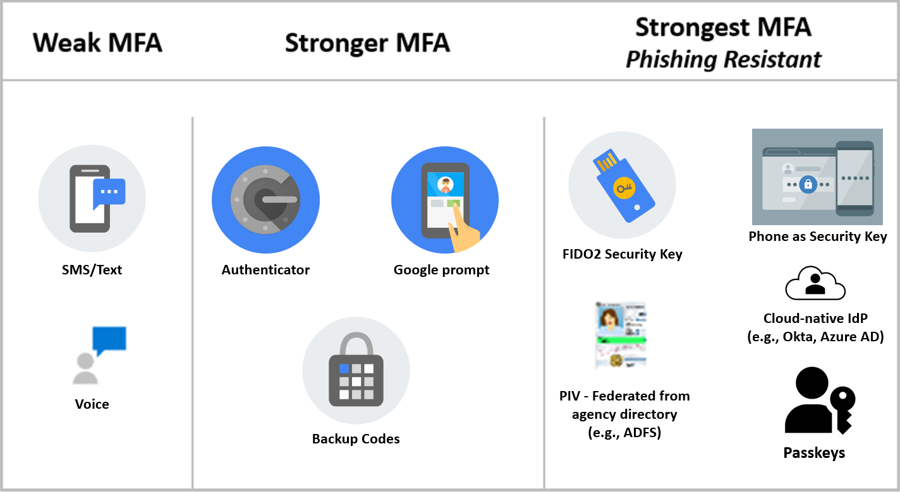

# CISA Google Workspace Secure Configuration Baseline for Common Controls

The Google Workspace (GWS) Admin console is the primary configuration hub for configuring and setting up the subscription. The scope of this document is to provide recommendations for setting up the subscription's security controls. This Secure Configuration Baseline (SCB) provides specific policies to strengthen the security of a GWS tenant.

The Secure Cloud Business Applications (SCuBA) project, run by the Cybersecurity and Infrastructure Security Agency (CISA), provides guidance and capabilities to secure federal civilian executive branch (FCEB) agencies' cloud business application environments and protect federal information that is created, accessed, shared, and stored in those environments.

The CISA SCuBA SCBs for GWS help secure federal information assets stored within GWS cloud business application environments through consistent, effective, and manageable security configurations. CISA created baselines tailored to the federal government's threats and risk tolerance. Organizations outside of the Federal Government may also find these baselines to be useful references to help reduce risks even if such organizations have different risk tolerances or face different threats.

For non-Federal users, the information in this document is being provided "as is" for INFORMATIONAL PURPOSES ONLY. CISA does not endorse any commercial product or service, including any subjects of analysis. Any reference to specific commercial entities or commercial products, processes, or services by service mark, trademark, manufacturer, or otherwise, does not constitute or imply endorsement, recommendation, or favoritism by CISA. Without limiting the generality of the foregoing, some controls and settings are not available in all products; CISA has no control over vendor changes to products offerings or features. Accordingly, these SCuBA SCBs for GWS may not be applicable to the products available to you. This document does not address, ensure compliance with, or supersede any law, regulation, or other authority. Entities are responsible for complying with any recordkeeping, privacy, and other laws that may apply to the use of technology. This document is not intended to, and does not, create any right or benefit for anyone against the United States, its departments, agencies, or entities, its officers, employees, or agents, or any other person.

This baseline is based on Google documentation and addresses the following:
- [Phishing-Resistant Multifactor Authentication](#1-phishing-resistant-multifactor-authentication)
- [Context Aware Access](#2-context-aware-access)
- [Login Challenges](#3-login-challenges)
- [User Session Duration](#4-user-session-duration)
- [Secure Passwords](#5-secure-passwords)
- [Privileged Accounts](#6-privileged-accounts)
- [Conflicting Account Management](#7-conflicting-account-management)
- [Account Recovery Options](#8-account-recovery-options)
- [GWS Advanced Protection Program](#9-gws-advanced-protection-program)
- [App Access to Google APIs](#10-app-access-to-google-apis)
- [Authorized Marketplace Apps](#11-authorized-google-marketplace-apps)
- [Google Takeout Service](#12-google-takeout-services-for-users)
- [System-Defined Rules](#13-system-defined-rules)
- [Google Workspace Logs](#14-google-workspace-logs)
- [Data Regions](#15-data-regions-and-storage)
- [Additional Google Services](#16-additional-google-services)
- [Multi-Party Approvals](#17-multi-party-approval)
- [Data Loss Prevention](#18-data-loss-prevention)

## Assumptions

This document assumes the organization is using GWS Enterprise Plus. The Google Workspace (GWS) Common Controls Secure Configuration Baseline is unique among the GWS configuration baseline documents released by CISA in that it does not align to one specific GWS app. Implementers should be aware of this when cross-referencing the baseline statements to the live GWS admin console. Therefore, this document serves an enterprise-level compendium of implementable and testable configuration settings across the entire GWS admin console. The configurations specified herein correlate to the Security, Account, Directory, Rules, and Marketplace apps sections of the GWS admin console.

This document does not address, ensure compliance with, or supersede any law, regulation, or other authority.  Entities are responsible for complying with any recordkeeping, privacy, and other laws that may apply to the use of technology.  This document is not intended to, and does not, create any right or benefit for anyone against the United States, its departments, agencies, or entities, its officers, employees, or agents, or any other person.

This Common Controls baseline document:

-   Assumes users are familiar with overarching Federal cyber guidance and cloud security fundamentals such as the shared responsibility model;
-   Accounts for recent direction from Executive Order 14028, the Federal Zero Trust Strategy (published as Office of Management & Budget Memo M-22-09 *Moving the U.S. Government Toward Zero Trust Cybersecurity Principles*), CISA's Zero Trust Maturity Model, and the Federal Cloud Security Technical Reference Architecture;
-   Observes industry guidance such as the Center for Internet Security's Google Workspace Foundations benchmark and Google official documentation and white papers; and
-   Was developed with input from both the Office of Management & Budget (OMB) and Google product managers and security engineers.

## Key Terminology

The key words "MUST", "MUST NOT", "REQUIRED", "SHALL", "SHALL NOT", "SHOULD", "SHOULD NOT", "RECOMMENDED", "MAY", and "OPTIONAL" in this document are to be interpreted as described in RFC 2119.

# Baseline Policies

## 1. Phishing-Resistant Multifactor Authentication

Multifactor authentication (MFA), particularly phishing-resistant MFA, is a critical security control against attacks such as password spraying, password theft, and phishing. Adopting phishing-resistant MFA may take time, especially on mobile devices. Organizations must upgrade to a phishing-resistant MFA method as soon as possible to be compliant with OMB M-22-09 and this policy to address the critical security threat posed by modern phishing attacks.

This control recognizes federation as a viable option for phishing-resistant MFA and includes architectural considerations around on-premises and cloud-native identity federation in established Federal Civilian Executive Branch (FCEB) environments. Federation for GWS can be implemented via a cloud-native identity provider (IdP). Google's documentation acknowledges that on-premises Active Directory implementations may be predominant in environments that adopt GWS and provides guidance on the use of Google Cloud Directory Sync (GCDS) to synchronize Google Account data with an established Microsoft Active Directory or LDAP server.

The following graphic illustrates the spectrum of MFA options and their relative strength, with phishing resistant MFA (per OMB Memo 22-09) being the mandated method.
Please note there is a distinction between Google 2 Step Verification (2SV) and MFA as a general term. While FIDO Security Key and Phone as a Security Key are acceptable forms of Phishing-Resistant MFA which rely on Google 2SV as the underlying mechanism, the other forms listed in the "strongest" column do not use Google
2SV but are still acceptable forms of Phishing-Resistant MFA.

### Policies

#### GWS.COMMONCONTROLS.1.1v0.5
Phishing-Resistant MFA SHALL be required for all users.

        > Phishing-resistant methods:

            - FIDO2 Security Key (directly in Google Workspace)

            - Phone as Security Key

            - FIDO2 Security Key (Federated from Identity Provider)

            - Federal Personal Identity Verification (PIV) card (Federated from agency Active Directory or other identity provider).

            - Google Passkeys

- _Rationale:_ Weaker forms of MFA do not protect against more sophisticated phishing attacks. Enforcing methods resistant to phishing reduces those risks. Additionally, phishing-resistant MFA is required for agency staff, contractors, and partners, by Office of Management and Budget Memo M-22-09.
- _Last modified:_ January 2025

- MITRE ATT&CK TTP Mapping
  - [T1621: MFA Request Generation](https://attack.mitre.org/techniques/T1621/)
  - [T1110: Brute Force](https://attack.mitre.org/techniques/T1110/)
    - [T1110:001: Brute Force: Password Guessing](https://attack.mitre.org/techniques/T1110/001/)
    - [T1110:002: Brute Force: Password Cracking](https://attack.mitre.org/techniques/T1110/002/)
    - [T1110:003: Brute Force: Password Spraying](https://attack.mitre.org/techniques/T1110/003/)
  - [T1556: Modifying Authentication Process](https://attack.mitre.org/techniques/T1556/)
    - [T1556:006: Modifying Authentication Process: Multi-Factor Authentication](https://attack.mitre.org/techniques/T1556/006/)
  - [T1566: Phishing](https://attack.mitre.org/techniques/T1566/)
    - [T1566:001: Phishing: Spearphishing Attachment](https://attack.mitre.org/techniques/T1566/001/)

#### GWS.COMMONCONTROLS.1.2v0.5
If phishing-resistant MFA has not been enforced, an alternative MFA method SHALL be enforced for all users.

- _Rationale:_ This is a stopgap security policy to help protect the tenant if phishing-resistant MFA has not been enforced. This policy requires MFA enforcement, thus reducing single-form authentication risk.
- _Last modified:_ April 2025

- MITRE ATT&CK TTP Mapping
  - [T1621: MFA Request Generation](https://attack.mitre.org/techniques/T1621/)
  - [T1110: Brute Force](https://attack.mitre.org/techniques/T1110/)
    - [T1110:001: Brute Force: Password Guessing](https://attack.mitre.org/techniques/T1110/001/)
    - [T1110:002: Brute Force: Password Cracking](https://attack.mitre.org/techniques/T1110/002/)
    - [T1110:003: Brute Force: Password Spraying](https://attack.mitre.org/techniques/T1110/003/)
  - [T1556: Modifying Authentication Process](https://attack.mitre.org/techniques/T1556/)
    - [T1556:006: Modifying Authentication Process: Multi-Factor Authentication](https://attack.mitre.org/techniques/T1556/006/)
  - [T1566: Phishing](https://attack.mitre.org/techniques/T1566/)
    - [T1566:001: Phishing: Spearphishing Attachment](https://attack.mitre.org/techniques/T1566/001/)

#### GWS.COMMONCONTROLS.1.3v0.5
SMS or Voice as the MFA method SHALL NOT be used.

- _Rationale:_ Weaker forms of MFA do not protect against more sophisticated phishing attacks. Enforcing methods resistant to phishing reduces those risks. Additionally, phishing-resistant MFA is required for agency staff, contractors, and partners, by Office of Management and Budget Memo M-22-09.
- _Last modified:_ April 2025

- MITRE ATT&CK TTP Mapping
  - [T1621: MFA Request Generation](https://attack.mitre.org/techniques/T1621/)
  - [T1110: Brute Force](https://attack.mitre.org/techniques/T1110/)
    - [T1110:001: Brute Force: Password Guessing](https://attack.mitre.org/techniques/T1110/001/)
    - [T1110:002: Brute Force: Password Cracking](https://attack.mitre.org/techniques/T1110/002/)
    - [T1110:003: Brute Force: Password Spraying](https://attack.mitre.org/techniques/T1110/003/)
  - [T1556: Modifying Authentication Process](https://attack.mitre.org/techniques/T1556/)
    - [T1556:006: Modifying Authentication Process: Multi-Factor Authentication](https://attack.mitre.org/techniques/T1556/006/)
  - [T1566: Phishing](https://attack.mitre.org/techniques/T1566/)
    - [T1566:001: Phishing: Spearphishing Attachment](https://attack.mitre.org/techniques/T1566/001/)

#### GWS.COMMONCONTROLS.1.4v0.5
Google 2SV new user enrollment period SHALL be set to at least 1 day or at most 1 week.

- _Rationale:_ Enrollment must be enforced within a reasonable timeframe. One week balances the need for allowing new personnel time to set up their authentication methods and reducing the risks inherent to not enforcing MFA immediately.
- _Last modified:_ April 2025

- MITRE ATT&CK TTP Mapping
  - [T1621: MFA Request Generation](https://attack.mitre.org/techniques/T1621/)
  - [T1110: Brute Force](https://attack.mitre.org/techniques/T1110/)
    - [T1110:001: Brute Force: Password Guessing](https://attack.mitre.org/techniques/T1110/001/)
    - [T1110:002: Brute Force: Password Cracking](https://attack.mitre.org/techniques/T1110/002/)
    - [T1110:003: Brute Force: Password Spraying](https://attack.mitre.org/techniques/T1110/003/)
  - [T1556: Modifying Authentication Process](https://attack.mitre.org/techniques/T1556/)
    - [T1556:006: Modifying Authentication Process: Multi-Factor Authentication](https://attack.mitre.org/techniques/T1556/006/)
  - [T1566: Phishing](https://attack.mitre.org/techniques/T1566/)
    - [T1566:001: Phishing: Spearphishing Attachment](https://attack.mitre.org/techniques/T1566/001/)

#### GWS.COMMONCONTROLS.1.5v0.5
Allow users to trust the device SHALL be disabled.

- _Rationale:_ Trusting the device allows users to bypass 2-Step Verification for future logins on that device. Disabling device trusting makes it possible for future logins on the same device to be protected by MFA.
- _Last modified:_ February 2025

- MITRE ATT&CK TTP Mapping
  - [T1621: MFA Request Generation](https://attack.mitre.org/techniques/T1621/)
  - [T1110: Brute Force](https://attack.mitre.org/techniques/T1110/)
    - [T1110:001: Brute Force: Password Guessing](https://attack.mitre.org/techniques/T1110/001/)
    - [T1110:002: Brute Force: Password Cracking](https://attack.mitre.org/techniques/T1110/002/)
    - [T1110:003: Brute Force: Password Spraying](https://attack.mitre.org/techniques/T1110/003/)
  - [T1556: Modifying Authentication Process](https://attack.mitre.org/techniques/T1556/)
    - [T1556:006: Modifying Authentication Process: Multi-Factor Authentication](https://attack.mitre.org/techniques/T1556/006/)
  - [T1566: Phishing](https://attack.mitre.org/techniques/T1566/)
    - [T1566:001: Phishing: Spearphishing Attachment](https://attack.mitre.org/techniques/T1566/001/)

### Resources

-  [GWS Admin Help \| Set up 2-Step Verification (Deploy)](https://support.google.com/a/answer/9176657?hl=en&ref_topic=2759193&fl=1#zippy=%2Cchoose-a--step-verification-method-to-enforce%2Cturn-on-enforcement)
-   [GWS Admin Help \| Set up 2-Step Verification (Protect your business)](https://support.google.com/a/answer/175197#zippy=%2Csecurity-keys%2Cconsider-using-security-keys-in-your-business)
-   [Google Workspace Updates \| Simplify and Strengthen Sign-In by Enabling Passkeys for Your Users](https://workspaceupdates.googleblog.com/2023/06/passkey-open-beta.html)
-   [Google Security Blog \| So Long Passwords, Thanks for all the Phish](https://security.googleblog.com/2023/05/so-long-passwords-thanks-for-all-phish.html)
-   [CIS Google Workspace Foundations Benchmark](https://www.cisecurity.org/benchmark/google_workspace)

### Prerequisites

-   GWS.COMMONCONTROLS.1.1v0.5 may require FIDO2-compliant security keys

### Implementation

#### Policy 1 Common Instructions
1.  Sign in to [Google Admin console](https://admin.google.com/) as an administrator.
2.  Select **Security** -\> **Authentication**.
3.  Select **2-Step Verification**.

#### GWS.COMMONCONTROLS.1.1v0.5 Instructions
1.  Under **Authentication**, ensure that **Allow users to turn on 2-Step Verification** is checked.
2.  Set **Enforcement** to **On.**
3.  Under **Methods** select **Only security key.**
4.  Under **Security codes** select **Don't allow users to select security codes.**
5.  Select **Save**.

#### GWS.COMMONCONTROLS.1.2v0.5 Instructions
1.  Under **Authentication**, ensure that **Allow users to turn on 2-Step Verification** is checked.
2.  Set **Enforcement** to **On**.

#### GWS.COMMONCONTROLS.1.3v0.5 Instructions
1.  Under **Methods**, select **Any except verification codes via text, phone call**.
2.  Select **Save**.

#### GWS.COMMONCONTROLS.1.4v0.5 Instructions
1.  Set **New user enrollment** period to at least **1 Day** or at most **1 Week**.
2.  Select **Save**.

#### GWS.COMMONCONTROLS.1.5v0.5 Instructions
1.  Under Frequency, deselect the **Allow user to trust device** checkbox.
2.  Select **Save**.

## 2. Context-aware Access

Device-based context-aware access provides access control policies based on device disposition attributes such as compliance with organizational secure configuration policies for devices (e.g., managed by Unified Endpoint Management). GWS also provides other context-aware access policies based on authentication and network information. These can be used to implement more targeted access policies. For advanced use cases, custom context aware access rules can be authored using the Common Expressions Language (CEL).

Device-based context-aware access can be used in several ways depending on agency business requirements. The following options are all acceptable approaches:

-   Properties of the device as reported by Google (encryption, screen lock, OS version, etc.)
-   Device inventory status (corporate-issued versus BYOD)
-   Use of Managed Chrome Browser
-   Data based on integration with certain third-party device management tools

It is extremely important to know how context-aware access policies affect one another, for example:

-   At a given scope (e.g., Organizational Unit [OU] or Group), each context aware access rule is evaluated separately. If any rule grants access, then access is allowed to the given application.
-   If rules are applied to OUs and Groups, which allow an action that may be denied after evaluating a policy at a higher level, then access will be allowed.

To enforce a device policy that requires company-owned devices, Google needs a list of serial numbers for company-owned devices.

### Policies

#### GWS.COMMONCONTROLS.2.1v0.5
Policies restricting access to GWS based on signals about enterprise devices SHOULD be implemented.

- _Rationale:_ Granular device access control afforded by context-aware access is in alignment with Federal zero trust strategy and principles. Context-aware access can help to increase the security of your GWS data by allowing you to restrict access to certain applications or services based on user/device attributes.
- _Last modified:_ July 2023
- _Note:_ More granular controls may be used if the agency needs it.

- MITRE ATT&CK TTP Mapping
  - [T1098: Account Manipulation](https://attack.mitre.org/techniques/T1098/)
    - [T1098:005: Account Manipulation: Device Registration](https://attack.mitre.org/techniques/T1098/005/)

### Resources

-   [GWS Admin Help \| Context-Aware Access overview](https://support.google.com/a/answer/9275380)
-   [GWS Admin Help \| Context-Aware Access examples for Basic mode](https://support.google.com/a/answer/9587667)
-   [GWS Admin Help \| Context-Aware Access examples for Advanced mode](https://support.google.com/a/answer/11368990)
-   [GWS Admin Help \| Device management security checklist](https://support.google.com/a/answer/7422256)
-   [GWS Admin Help \| Set up guide: Deploy company-owned devices in Google endpoint management](https://support.google.com/a/answer/10287358)
-   [GWS Admin Help \| Turn endpoint verification on or off](https://support.google.com/a/answer/9007320)
-   [GWS Admin Help \| Set up guide: Deploy company-owned devices in Google endpoint management—Steps 1 and 2](https://support.google.com/a/answer/10287358#zippy=%2Cstep-sign-up-for-enterprise-management-services%2Cstep-source-devices)
-   [GitHub \| Google \| Google Common Expressions Language (CEL)](https://github.com/google/cel-spec)
-   [Google Cloud Access Context Manager \| Macros for CEL expressions](https://cloud.google.com/access-context-manager/docs/custom-access-level-spec#macros_for_cel_expressions)
-   [Google Cloud Access Context Manager \| Custom access level specification](https://cloud.google.com/access-context-manager/docs/custom-access-level-spec)
-   [GWS Blog \| Enable advanced context-aware access to Google Workspace in the Admin console](https://workspaceupdates.googleblog.com/2021/11/enable-advanced-context-aware-access-to.html)
-  [GWS Admin Help \| Google Workspace Device management security checklist](https://support.google.com/a/answer/7422256)
-   [GWS Admin Help \| Deploy Context-Aware Access](https://support.google.com/a/answer/12643733)

### Prerequisites

-   One or more of the following user roles should have been configured to set context-aware policies:

        > Super admin

        > Delegated admin with each of these privileges:

                - Data Security -\> Access level management

                - Data Security -\> Rule management

                - Admin API Privileges -\> Groups\>Read

                - Admin API Privileges -\> Users\>Read

-   Serial numbers may be required to enforce a policy for company-owned devices. Refer to [Google documentation](https://support.google.com/a/answer/10287358) on device management for additional guidance.

### Implementation

#### GWS.COMMONCONTROLS.2.1v0.5 Instructions
To turn on Context-Aware Access:

1.  Access the [Google Admin console](https://admin.google.com/).
2.  From the menu, go to **Security** -\> **Access and data control** -\> **Context-Aware Access**.
3.  Verify **Context-Aware Access** is **ON for everyone**. If not, click **Turn On**.
4.  Select **Access Level** and select **Create Access Level** and determine the conditions of the rule per agency needs.
5.  Select **Assign access levels to apps** and select Apps to apply the rule onto.

Note that the implementation details of context-aware access use cases will vary per agency. Refer to [Google's documentation](https://support.google.com/a/answer/12643733) on implementing context-aware access for your specific use cases. Common use cases include:
-   Require company-owned on desktop but not on mobile device
-   Require basic device security
-   Allow access to contractors only through the corporate network
-   Block access from known hijacker IP addresses
-   Allow or disallow access from specific locations
-   Use nested access levels instead of selecting multiple access levels during assignment

## 3. Login Challenges
Login challenges are additional security measures used to verify a user's identity, including post-SSO verification.

Post-SSO verification controls what additional checks are performed (e.g., Google 2SV) after a user succesfully authenticates through a third-party identity provider.
SSO is managed through profiles, which can be assigned org-wide or to specific org units/groups.
Google Workspace handles post-SSO verification for profiles assigned org-wide as a separate case, allowing users more granual control of when post-SSO verification requirements apply.

### Policies

#### GWS.COMMONCONTROLS.3.1v0.5
Post-SSO verification SHOULD be enabled for users signing in using the SSO profile for your organization.

- _Rationale:_ Without enabling post-SSO verification, any Google 2-Step Verification (2SV) configuration is ignored for third-party SSO users. Enabling post-SSO verification will apply 2SV verification policies.
- _Last modified:_ January 2025

- MITRE ATT&CK TTP Mapping
  - [T1110: Brute Force](https://attack.mitre.org/techniques/T1110/)
    - [T1110:001: Brute Force: Password Guessing](https://attack.mitre.org/techniques/T1110/001/)
    - [T1110:002: Brute Force: Password Cracking](https://attack.mitre.org/techniques/T1110/002/)
    - [T1110:003: Brute Force: Password Spraying](https://attack.mitre.org/techniques/T1110/003/)

#### GWS.COMMONCONTROLS.3.2v0.5
Post-SSO verification SHOULD be enabled for users signing in using other SSO profiles.

- _Rationale:_ Without enabling post-SSO verification, any Google 2-Step Verification (2SV) configuration is ignored for third-party SSO users. Enabling post-SSO verification will apply 2SV verification policies.
- _Last modified:_ November 2024

- MITRE ATT&CK TTP Mapping
  - [T1110: Brute Force](https://attack.mitre.org/techniques/T1110/)
    - [T1110:001: Brute Force: Password Guessing](https://attack.mitre.org/techniques/T1110/001/)
    - [T1110:002: Brute Force: Password Cracking](https://attack.mitre.org/techniques/T1110/002/)
    - [T1110:003: Brute Force: Password Spraying](https://attack.mitre.org/techniques/T1110/003/)

### Resources

-   [GWS Admin Help \| Protect Google Workspace accounts with security challenges](https://support.google.com/a/answer/6002699)
-   [CIS Google Workspace Foundations Benchmark](https://www.cisecurity.org/benchmark/google_workspace)

### Prerequisites

-   None

### Implementation

#### Policy Group 3 Common Instructions
1.  Sign in to [Google Admin console](https://admin.google.com) as an administrator.
2.  Select **Security**-\>**Authentication**-\>**Login challenges**.
3.  Under **Organizational units**, ensure that the name for the entire organization is selected.
4.  Click **Post-SSO verification**.

#### GWS.COMMONCONTROLS.3.1v0.5 Instructions
1. For **Settings for users signing in using the SSO profile for your organization**, select **Ask users for additional verifications from Google if a sign-in looks suspicious, and always apply 2-Step Verification policies (if configured)**.
2. Click **SAVE**.

#### GWS.COMMONCONTROLS.3.2v0.5 Instructions
1. For **Settings for users signing in using other SSO profiles**, select **Ask users for additional verifications from Google if a sign-in looks suspicious, and always apply 2-Step Verification policies (if configured)**.
2. Click **SAVE**.

## 4. User Session Duration

This control allows configuring of limits on how long a GWS session can be active before being prompted for authentication credentials.

Note: If using a third-party IdP, and agency-set web session lengths for its users, then there will be a need to set the IdP session length parameter to expire before the Google session expires to ensure users are forced to sign in again. See [GWS documentation](https://support.google.com/a/answer/7576830) for additional details.

### Policies

#### GWS.COMMONCONTROLS.4.1v0.5
Users SHALL be forced to re-authenticate after an established 12-hour GWS login session has expired.

- _Rationale:_ Allowing sessions to persist indefinitely allows users to bypass 2-Step Verification for future activity on that device. Limiting sessions to 12 hours may reduce the impact of session hijacking attacks and prevent users from inadvertently remaining logged in on unattended devices.
- _Last modified:_ July 2023

- MITRE ATT&CK TTP Mapping
  - [T1550: Use Alternate Authentication Material](https://attack.mitre.org/techniques/T1550/)
    - [T1550:004: Use Alternate Authentication Material: Web Session Cookie](https://attack.mitre.org/techniques/T1550/004/)
  - [T1078: Valid Accounts](https://attack.mitre.org/techniques/T1078/)
    - [T1078:004: Valid Accounts: Cloud Accounts](https://attack.mitre.org/techniques/T1078/004/)

### Resources

-   [GWS Admin Help \| Set session length for Google services](https://support.google.com/a/answer/7576830?hl=en)

### Prerequisites

-   None

### Implementation

#### GWS.COMMONCONTROLS.4.1v0.5 Instructions
To configure Google session control:

1.  Sign in to the [Google Admin console](https://admin.google.com) as an administrator.
2.  Select **Security.**
3.  Select **Access and data control** -\> **Google session control.**
4.  Look for the **Web session duration** heading.
5.  Set the duration to **12 hours.**

## 5. Secure Passwords

Per NIST 800-63 and OMB M-22-09, ensure that user passwords do not expire and that long passwords are chosen. Research indicates that frequent password rotation breeds poor password choice and encourages password reuse. Ensure that passwords are strong to defend against brute-force attacks. Ensure that passwords are not reused to defend against credential theft.

### Policies

#### GWS.COMMONCONTROLS.5.1v0.5
User password strength SHALL be enforced.

- _Rationale:_ Weak passwords increase the risk of account compromise. Enforcing password strength adds an additional layer of defense, reducing the risk of account compromise.
 Strong password policies protect an organization by prohibiting the use of weak passwords.
- _Last modified:_ July 2023

- MITRE ATT&CK TTP Mapping
  - [T1110: Brute Force](https://attack.mitre.org/techniques/T1110/)
    - [T1110:001: Brute Force: Password Guessing](https://attack.mitre.org/techniques/T1110/001/)
    - [T1110:002: Brute Force: Password Cracking](https://attack.mitre.org/techniques/T1110/002/)
    - [T1110:003: Brute Force: Password Spraying](https://attack.mitre.org/techniques/T1110/003/)

#### GWS.COMMONCONTROLS.5.2v0.5
User password length SHALL be at least 12 characters.

- _Rationale:_ The National Institute of Standards and Technology (NIST) has published guidance indicating that password length is a primary factor in characterizing password strength (NIST SP 800-63B). Longer passwords tend to be more resistant to brute force and dictionary-based attacks.
- _Last modified:_ July 2023

- MITRE ATT&CK TTP Mapping
  - [T1110: Brute Force](https://attack.mitre.org/techniques/T1110/)
    - [T1110:001: Brute Force: Password Guessing](https://attack.mitre.org/techniques/T1110/001/)
    - [T1110:002: Brute Force: Password Cracking](https://attack.mitre.org/techniques/T1110/002/)
    - [T1110:003: Brute Force: Password Spraying](https://attack.mitre.org/techniques/T1110/003/)

#### GWS.COMMONCONTROLS.5.3v0.5
User password length SHOULD be at least 15 characters.

- _Rationale:_ The National Institute of Standards and Technology (NIST) has published guidance indicating that password length is a primary factor in characterizing password strength (NIST SP 800-63B). Longer passwords tend to be more resistant to brute force and dictionary-based attacks.
- _Last modified:_ January 2025

- MITRE ATT&CK TTP Mapping
  - [T1110: Brute Force](https://attack.mitre.org/techniques/T1110/)
    - [T1110:001: Brute Force: Password Guessing](https://attack.mitre.org/techniques/T1110/001/)
    - [T1110:002: Brute Force: Password Cracking](https://attack.mitre.org/techniques/T1110/002/)
    - [T1110:003: Brute Force: Password Spraying](https://attack.mitre.org/techniques/T1110/003/)

#### GWS.COMMONCONTROLS.5.4v0.5
Password policy SHALL be enforced at next sign-in.

- _Rationale:_ Unless the password policy is enforced at next login, a user could potentially operate indefinitely using a weak password. Enforcing the policy at next login helps ensure that all active user passwords meet current requirements.
- _Last modified:_ July 2023

- MITRE ATT&CK TTP Mapping
  - [T1110: Brute Force](https://attack.mitre.org/techniques/T1110/)
    - [T1110:001: Brute Force: Password Guessing](https://attack.mitre.org/techniques/T1110/001/)
    - [T1110:002: Brute Force: Password Cracking](https://attack.mitre.org/techniques/T1110/002/)
    - [T1110:003: Brute Force: Password Spraying](https://attack.mitre.org/techniques/T1110/003/)

#### GWS.COMMONCONTROLS.5.5v0.5
User passwords SHALL NOT be reused.

- _Rationale:_ Password reuse represents a significant security risk. Preventing password reuse when possible limits the scope of a compromised password.
- _Last modified:_ July 2023

- MITRE ATT&CK TTP Mapping
  - [T1110: Brute Force](https://attack.mitre.org/techniques/T1110/)
    - [T1110:001: Brute Force: Password Guessing](https://attack.mitre.org/techniques/T1110/001/)
    - [T1110:002: Brute Force: Password Cracking](https://attack.mitre.org/techniques/T1110/002/)
    - [T1110:003: Brute Force: Password Spraying](https://attack.mitre.org/techniques/T1110/003/)

#### GWS.COMMONCONTROLS.5.6v0.5
User passwords SHALL NOT expire.

- _Rationale:_ The National Institute of Standards and Technology (NIST), OMB, and Microsoft have published guidance indicating mandated periodic password changes make user accounts less secure. For example, OMB M-22-09 states, "Password policies must not require use of special characters or regular rotation."
- _Last modified:_ July 2023

- MITRE ATT&CK TTP Mapping
  - [T1110: Brute Force](https://attack.mitre.org/techniques/T1110/)
    - [T1110:001: Brute Force: Password Guessing](https://attack.mitre.org/techniques/T1110/001/)
    - [T1110:002: Brute Force: Password Cracking](https://attack.mitre.org/techniques/T1110/002/)
    - [T1110:003: Brute Force: Password Spraying](https://attack.mitre.org/techniques/T1110/003/)

### Resources

-   [GWS Admin Help \| Enforce and monitor password requirements for users](https://support.google.com/a/answer/139399?hl=en#zippy=%2Cwhat-makes-a-password-strong)
-   [Create a strong password & a more secure account](https://support.google.com/accounts/answer/9094506?fl=1&sjid=14948418137648107240-NA)
-   [CISA Cross-Sector Cybersecurity Performance Goals](https://www.cisa.gov/cross-sector-cybersecurity-performance-goals#MinimumPasswordStrength2B)

### Prerequisites

-   None

### Implementation

To configure a strong password policy is configured, use the Google Workspace Admin Console:

#### Policy Group 5 common Instructions
1.  Sign in to the [Google Admin console](https://admin.google.com) as an administrator.
2.  Select **Security** -\> **Authentication.**
3.  Locate **Password management.**
4. Follow implementation for each individual policy.
5. Select **Save**.

#### GWS.COMMONCONTROLS.5.1v0.5 Instructions
1.  Under **Strength**, select the **Enforce strong password** checkbox.

#### GWS.COMMONCONTROLS.5.2v0.5 Instructions
1.  Under **Length**, set **Minimum Length** to 12+.

#### GWS.COMMONCONTROLS.5.3v0.5 Instructions
1.  Under **Length**, set **Minimum Length** to 15+.

#### GWS.COMMONCONTROLS.5.4v0.5 Instructions
1.  Under **Strength and Length enforcement**, select the **Enforce password policy at next sign-in** checkbox.

#### GWS.COMMONCONTROLS.5.5v0.5 Instructions
1.  Under **Reuse**, deselect the **Allow password reuse** checkbox.

#### GWS.COMMONCONTROLS.5.6v0.5 Instructions
1.  Under **Expiration**, select **Never Expires.**

## 6. Privileged Accounts

Administrative or admin accounts are privileged accounts in GWS that can manage settings, access sensitive data, and perform critical functions. The compromise of an admin account could have catastrophic impacts on the Workspace organization. This section defines privileged accounts as both pre-built and custom admin accounts.

Some examples of these privileged accounts include the following Pre-Built GWS Admin Roles:

-   Super Admin: This role possesses critical control over the entire GWS structure. It has access to all features in the Admin Console and Admin API and can manage every aspect of an agency's GWS accounts.
-   User Management Admin: This account has rights to add, remove, and delete normal users in addition to managing all user passwords, security settings, and other management tasks that make it potentially crucial if compromised.
-   Services Admin: This admin has full rights to turn on or off GWS services and security settings for these services (Gmail, Drive, Voice, etc.). Given that most GWS features are premised on these services being secure, compromise of this account would be critical.
-   Mobile Admin: This admin has full rights to manage all of an agency's mobile devices including authorizing their use and controlling the apps that can be downloaded and used on them. This admin also can set the security policies on all agency mobile devices connected to GWS.
-   Groups Admin: This admin has full rights to view profiles in the organizational and Organizational Unit (OU) structures and can manage all rights for members in the groups.

### Policies

#### GWS.COMMONCONTROLS.6.1v0.5
All administrative accounts SHALL leverage Google Account authentication with phishing-resistant multifactor authentication(MFA), not an agency's authoritative on-premises or federated identity system.

- _Rationale:_ Leveraging Google Account authentication with phishing resistant MFA for highly privileged accounts reduces the risks associated with a compromise of on-premises federation infrastructure. This makes it more challenging for an adversary to pivot from a compromised on-premises environment to the cloud with privileged access.
- _Last modified:_ January 2025

- MITRE ATT&CK TTP Mapping
  - [T1110: Brute Force](https://attack.mitre.org/techniques/T1110/)
    - [T1110:001: Brute Force: Password Guessing](https://attack.mitre.org/techniques/T1110/001/)
    - [T1110:002: Brute Force: Password Cracking](https://attack.mitre.org/techniques/T1110/002/)
    - [T1110:003: Brute Force: Password Spraying](https://attack.mitre.org/techniques/T1110/003/)
  - [T1556: Modifying Authentication Process](https://attack.mitre.org/techniques/T1556/)
    - [T1556:006: Modifying Authentication Process: Multi-Factor Authentication](https://attack.mitre.org/techniques/T1556/006/)

#### GWS.COMMONCONTROLS.6.2v0.5
A minimum of **two** and maximum of **eight** separate and distinct super admin users SHALL be configured.

- _Rationale:_ The super admin role provides unfettered access to the workspace. Properly managing the number of users with this level of access makes workspace compromise more challenging. However, having too few accounts can be problematic as it increases the risk of losing admin access entirely (e.g., if a super admin forgets their password); having between 2 and 4 balances these two concerns.
- _Last modified:_ July 2023
- _Note:_ Admin count does not include "break-glass" super admin accounts.

- MITRE ATT&CK TTP Mapping
  - [T1136: Create Account](https://attack.mitre.org/techniques/T1136/)
    - [T1136:003: Create Account: Cloud Account](https://attack.mitre.org/techniques/T1136/003/)
  - [T1098: Account Manipulation](https://attack.mitre.org/techniques/T1098/)
    - [T1098:003: Account Manipulation: Additional Cloud Roles](https://attack.mitre.org/techniques/T1098/003/)

### Resources

-   [Google Cloud Architecture Center \| Best practices for planning accounts and organizations](https://cloud.google.com/architecture/identity/best-practices-for-planning)
-   [GWS Admin Help \| Create, edit, and delete custom admin roles](https://support.google.com/a/answer/2406043)
-   [GWA Admin Help \| Assign Specific Admin Roles](https://support.google.com/a/answer/9807615?hl=en)
-   [GWA Admin Help \| Pre-Built Admin Roles](https://support.google.com/a/answer/2405986?hl=en)

### Prerequisites

-   Super admin users cannot log in to admin.google.com with a third-party IdP when using super admin level accounts—they must use Google Login as the authentication mechanism. This policy extends this rule to other admin types.
-   Delegated accounts, including the ones defined as highly privileged above, can by default, use a third-party IdP to access admin.google.com: however, this policy prohibits that practice. All highly privileged accounts must use phishing resistant Google Authentication.

### Implementation

#### GWS.COMMONCONTROLS.6.1v0.5 Instructions
1.  Determine how to track highly privileged accounts. For example, create an OU or group containing all highly privileged accounts.
2.  Follow the instructions on [Set up SSO for your organization](https://support.google.com/a/answer/12032922?hl=en), under "Decide which users should use SSO." For all OUs or groups with highly privileged users, set the **SSO profile assignment** to **None**.

#### GWS.COMMONCONTROLS.6.2v0.5 Instructions
To obtain a list of all GWS Super Admins:

1.  Sign in to the [Google Admin console](https://admin.google.com) as an administrator.
2.  Navigate to **Account** -\> **Admin Roles**.
3.  Click the **Super Admin** role in the list of roles
4.  The subsequent dialog provides a list of Super Admins.

## 7. Conflicting Account Management

It is possible for employees of an organization to create conflicting, unmanaged accounts that are unmanaged by an enterprise's Google Workspace tenant. Unmanaged accounts are defined as users who independently created a Google account using the organization's domain. For example, a user with an enterprise/corporate email of user@company.com could create a personal, unmanaged Google account using that email address. This would create an account conflict in a GWS tenant licensed to company.com since email addresses are unique.

Creating a conflicting account can also happen unintentionally. After signing up for Google Cloud Identity or Google Workspace, admins might decide to set up single sign-on with an external identity provider (IdP) such as Azure Active Directory (AD) or Active Directory. When configured, the external IdP might automatically create accounts in Cloud Identity or Google Workspace for all users for which single sign-on was enabled, inadvertently creating conflicting accounts.

Unmanaged accounts carry significant risk, as they cannot be managed by admins, rendering them outside of the scope of protection admins can apply to keep work data secure. Significantly, two-step verification (2SV) cannot be enforced. Even if access is revoked, these accounts can carry a social engineering risk. Further, reconciling conflicting accounts creates churn for admins and adds to the workload of onboarding users to Google Workspace & Google Cloud.

The GWS admin console provides several administrative options for handling conflicting, unmanaged accounts:
  - Automatically invite users to transfer unmanaged accounts.
  - Replace unmanaged accounts with managed ones.
  - Don't create new accounts if unmanaged accounts exist.

This policy requires replacing unmanaged accounts with managed ones. When this option is configured, data owned by the account will not be imported; the user will receive a temporary account address, which they'll need to manually replace with a @gmail.com address of their choice; the user will receive an email notification of this and are informed they cannot use the original email any longer.

By changing the email address, the user resolves the conflict by ensuring that the managed account and consumer account have different identities. The result remains that they have one consumer account that has all their original data, and one managed account that doesn't have access to the original data.

### Policies

#### GWS.COMMONCONTROLS.7.1v0.5
Account conflict management SHOULD be configured to replace conflicting unmanaged accounts with managed ones.

- _Rationale:_ Unmanaged user accounts cannot be controlled or monitored by Workspace admins. By resolving conflicting accounts, organizations can ensure all users in their Workspace are using managed accounts.
- _Last modified:_ April 2025

- MITRE ATT&CK TTP Mapping
  - [T1136: Create Account](https://attack.mitre.org/techniques/T1136/)
    - [T1136:003: Create Account: Cloud Account](https://attack.mitre.org/techniques/T1136/003/)
  - [T1098: Account Manipulation](https://attack.mitre.org/techniques/T1098/)
    - [T1098:003: Account Manipulation: Additional Cloud Roles](https://attack.mitre.org/techniques/T1098/003/)
  - [T1078: Valid Accounts](https://attack.mitre.org/techniques/T1078/)

### Resources

-   [GWS Admin Help | Use the transfer tool to migrate unmanaged users](https://support.google.com/a/answer/6178640)
-   [GWS Admin Help | Find and add unmanaged users](https://support.google.com/a/answer/11112794)
-   [Google Workspace Updates Blog | Resolve conflict accounts faster with the new Conflict Accounts Management tool](https://workspaceupdates.googleblog.com/2023/08/conflict-accounts-management-tool.html)
-   [Google Cloud Architecture Center | Migrating consumer accounts](https://cloud.google.com/architecture/identity/migrating-consumer-accounts#using_a_conflicting_account)
-   [Google Cloud Architecture Center | Best practices for planning accounts and organizations](https://cloud.google.com/architecture/identity/best-practices-for-planning)
-   [How a conflicting account is created](https://support.google.com/accounts/answer/181526)

### Prerequisites

-   Super Admin privileges

### Implementation
#### GWS.COMMONCONTROLS.7.1v0.5 Instructions

To configure account conflict management per the policy:
1.	Sign in to the [Google Admin console](https://admin.google.com) as an administrator.
2.	Navigate to **Account** -\> **Account settings.**
3.	Click the **Conflicting accounts management** card.
4.	Select the radio button option: **"Replace conflicting unmanaged accounts with managed ones."**
5.	Click **Save.**

## 8. Account Recovery Options

This section addresses the GWS account self-recovery feature. When enabled, this feature allows users to add a recovery email or phone number with which they can reset their own accounts if needed, without having to contact a Workspace admin for support.

### Policies

#### GWS.COMMONCONTROLS.8.1v0.5
Account self-recovery for super admins SHALL be disabled.

- _Rationale:_ If enabled, an adversary could attempt to gain access to a super admin account through the account recovery method. Disabling this feature forces super admins to contact another super admin to recover their account, making it more difficult for a potential adversary to compromise their account.
- _Last modified:_ July 2023

- MITRE ATT&CK TTP Mapping
  - [T1556: Modifying Authentication Process](https://attack.mitre.org/techniques/T1556/)
    - [T1556:006: Modifying Authentication Process: Multi-Factor Authentication](https://attack.mitre.org/techniques/T1556/006/)

#### GWS.COMMONCONTROLS.8.2v0.5
Account self-recovery for users and non-super admins SHALL be disabled.

- _Rationale:_ If enabled, a user could add a personal email or phone number for account recovery. Disabling this feature makes account recovery go through official channels, making it more difficult for a potential adversary to compromise an account.
- _Last modified:_ February 2025

- MITRE ATT&CK TTP Mapping
  - [T1556: Modifying Authentication Process](https://attack.mitre.org/techniques/T1556/)
    - [T1556:006: Modifying Authentication Process: Multi-Factor Authentication](https://attack.mitre.org/techniques/T1556/006/)

#### GWS.COMMONCONTROLS.8.3v0.5
Ability to add recovery information SHOULD be disabled.

- _Rationale:_ If enabled, a user could add a personal email or phone number for account recovery. Disabling this feature prevents a user from adding PII to their organizational account, making it more difficult for a potential adversary to steal PII in the event of a compromise.
- _Last modified:_ February 2025
- _Note:_ This setting doesn’t apply if you’re using single sign-on (SSO) with a third-party identity provider or Password Sync.

- MITRE ATT&CK TTP Mapping
  - [T1530: Data from Cloud Storage](https://attack.mitre.org/techniques/T1530/)

### Resources

-   [GWS Admin Help \| Allow super administrators to recover their password](https://support.google.com/a/answer/9436964?fl=1)
-   [GWS Admin Help \| Recover an account protected by 2-Step Verification](https://support.google.com/a/answer/9176734?hl=en)

### Prerequisites

-   None

### Implementation

#### GWS.COMMONCONTROLS.8.1v0.5 Instructions
To disable Super Admin account self-recovery:

1.  Sign in to https://admin.google.com as an administrator.
2.  Select **Security** -\> **Authentication**.
3.  Select **Account Recovery**.
4.  Click **Super admin account recovery**.
5.  Deselect the **Allow Super Admins to recover their account** checkbox.
6.  Click **Save**.

#### GWS.COMMONCONTROLS.8.2v0.5 Instructions
1.  Sign in to https://admin.google.com as an administrator.
2.  Select **Security** -\> **Authentication**.
3.  Select **Account Recovery**.
4.  Click **User account recovery**.
5.  Deselect the **Allow users and all non-super admins to recover their account** checkbox.
6.  Click **Save**.

#### GWS.COMMONCONTROLS.8.3v0.5 Instructions
1.  Sign in to https://admin.google.com as an administrator.
2.  Select **Security** -\> **Authentication**.
3.  Select **Account Recovery**. 
4.  Click **Recovery Information**.
5.  Deselect the **Allow admins and users to add recovery email information to their account** checkbox.
6.  Deselect the **Allow admins and users to add recovery phone information to their account** checkbox.
7.  Click **Save**.

## 9. GWS Advanced Protection Program

This control enforces more secure protection of highly privileged, senior executive and sensitive users accounts from targeted attacks. It enforces optional GWS user security features like:

-   Strong authentication with security keys
-   Use of security codes with security keys
-   Restrictions on third-party access to account data
-   Deep Gmail scans
-   Google Safe Browsing protections in Chrome
-   Account recovery through admin

### Policies

#### GWS.COMMONCONTROLS.9.1v0.5
Highly privileged accounts SHALL be enrolled in the GWS Advanced Protection Program.

- _Rationale:_ Sophisticated phishing tactics can trick even the most savvy users into giving their sign-in credentials to attackers. Advanced Protection requires you to use a security key, which is a hardware device or special software on your phone used to verify your identity, to sign in to your Google Account. Unauthorized users won't be able to sign in without your security key, even if they have your username and password. The Advanced Protection Program includes a curated group of high-security policies that are applied to enrolled accounts. Additional policies may be added to the Advanced Protection Program to ensure the protections are current.
- _Last modified:_ July 2023

- MITRE ATT&CK TTP Mapping
  - [T1110: Brute Force](https://attack.mitre.org/techniques/T1110/)
    - [T1110:001: Brute Force: Password Guessing](https://attack.mitre.org/techniques/T1110/001/)
    - [T1110:002: Brute Force: Password Cracking](https://attack.mitre.org/techniques/T1110/002/)
    - [T1110:003: Brute Force: Password Spraying](https://attack.mitre.org/techniques/T1110/003/)
  - [T1556: Modifying Authentication Process](https://attack.mitre.org/techniques/T1556/)
    - [T1556:006: Modifying Authentication Process: Multi-Factor Authentication](https://attack.mitre.org/techniques/T1556/006/)

#### GWS.COMMONCONTROLS.9.2v0.5
All sensitive user accounts SHOULD be enrolled into the GWS Advanced Protection Program.

- _Rationale:_ Sophisticated phishing tactics can trick even the most savvy users into giving their sign-in credentials to attackers. Advanced Protection requires you to use a security key, which is a hardware device or special software on your phone used to verify your identity, to sign in to your Google Account. Unauthorized users won't be able to sign in without your security key, even if they have your username and password. The Advanced Protection Program includes a curated group of high-security policies that are applied to enrolled accounts. Additional policies may be added to the Advanced Protection Program to ensure the protections are current.
- _Last modified:_ July 2023
- _Note:_ This control enforces more secure protection of sensitive user accounts from targeted attacks. Sensitive user accounts include political appointees, Senior Executive Service (SES) officials, or other senior officials whose account compromise would pose a level of risk prohibitive to agency mission fulfillment

- MITRE ATT&CK TTP Mapping
  - [T1110: Brute Force](https://attack.mitre.org/techniques/T1110/)
    - [T1110:001: Brute Force: Password Guessing](https://attack.mitre.org/techniques/T1110/001/)
    - [T1110:002: Brute Force: Password Cracking](https://attack.mitre.org/techniques/T1110/002/)
    - [T1110:003: Brute Force: Password Spraying](https://attack.mitre.org/techniques/T1110/003/)
  - [T1556: Modifying Authentication Process](https://attack.mitre.org/techniques/T1556/)
    - [T1556:006: Modifying Authentication Process: Multi-Factor Authentication](https://attack.mitre.org/techniques/T1556/006/)

### Resources

-   [GWS Admin Help \| Protect users with the Advanced Protection Program](https://support.google.com/a/answer/9378686)
-   [GWS Admin Help \| Advanced Protection Program FAQ](https://support.google.com/a/answer/9503534?hl=en)
-   [CIS Google Workspace Foundations Benchmark](https://www.cisecurity.org/benchmark/google_workspace)

### Prerequisites

-   Two security keys are required for added assurance. If one key is lost or damaged, users can use the second key to regain account access.

### Implementation

#### Policy Group 9 Instructions
To allow all users to enroll:

1.  Sign in to the [Google Admin console](https://admin.google.com) as an administrator.
2.  Select **Security -**\> **Authentication** -\> **Advanced Protection Program.**
3.  On the right, locate the **Advanced Protection** header.
4.  Locate the **Allow users to enroll in the Advanced Protection Program** header.
5.  Select **Enable user enrollment.**
6.  Click **SAVE.**

## 10. App Access to Google APIs

Agencies need to have a process in place to manage and control application access to GWS data. This control enables the ability to restrict access to Google Workspace APIs from other applications and is aimed at mitigating the significant cybersecurity risk posed by the potential compromise of OAuth tokens. The baseline policy statements are written to allow implementers to balance operational need with risk posed by granting app access.

### Policies

#### GWS.COMMONCONTROLS.10.1v0.5
Agencies SHALL use GWS application access control policies to restrict access to all GWS services by third party apps.

- _Rationale:_ Third-party apps may include malicious content. Restricting app access to only apps trusted by the agency reduces the risk of allowing malicious apps to connect to the workspace.
- _Last modified:_ July 2023

- MITRE ATT&CK TTP Mapping
  - [T1550: Use Alternate Authentication Materials](https://attack.mitre.org/techniques/T1550/)
    - [T1550:001: Use Alternate Authentication Materials: Application Access Token](https://attack.mitre.org/techniques/T1550/001/)
  - [T1195: Supply Chain Compromise](https://attack.mitre.org/techniques/T1195/)
    - [T1195:002: Supply Chain Compromise: Compromise Software Supply Chain](https://attack.mitre.org/techniques/T1195/002/)
  - [T1059: Command and Scripting Interpreter](https://attack.mitre.org/techniques/T1059/)
    - [T1059:009: Command and Scripting Interpreter: Cloud API](https://attack.mitre.org/techniques/T1059/009/)

#### GWS.COMMONCONTROLS.10.2v0.5
Agencies SHALL NOT allow users to consent to access to low-risk scopes.

- _Rationale:_ Allowing users to give access to OAuth scopes that aren't classified as high-risk could still allow for apps that are not trusted to be granted access by non-administrator personnel and without having to be allowlisted in accordance with policy 10.1.
- _Last modified:_ July 2023

- MITRE ATT&CK TTP Mapping
  - [T1550: Use Alternate Authentication Materials](https://attack.mitre.org/techniques/T1550/)
    - [T1550:001: Use Alternate Authentication Materials: Application Access Token](https://attack.mitre.org/techniques/T1550/001/)
  - [T1195: Supply Chain Compromise](https://attack.mitre.org/techniques/T1195/)
    - [T1195:002: Supply Chain Compromise: Compromise Software Supply Chain](https://attack.mitre.org/techniques/T1195/002/)
  - [T1059: Command and Scripting Interpreter](https://attack.mitre.org/techniques/T1059/)
    - [T1059:009: Command and Scripting Interpreter: Cloud API](https://attack.mitre.org/techniques/T1059/009/)

#### GWS.COMMONCONTROLS.10.3v0.5
Agencies SHALL NOT trust unconfigured internal apps.

- _Rationale:_ Internal apps may contain vulnerabilities or even malicious content created by compromised user accounts. Restricting access to these apps reduces the risk of allowing unsafe apps to connect to the workspace.
- _Last modified:_ July 2023

- MITRE ATT&CK TTP Mapping
  - [T1550: Use Alternate Authentication Materials](https://attack.mitre.org/techniques/T1550/)
    - [T1550:001: Use Alternate Authentication Materials: Application Access Token](https://attack.mitre.org/techniques/T1550/001/)
  - [T1195: Supply Chain Compromise](https://attack.mitre.org/techniques/T1195/)
    - [T1195:002: Supply Chain Compromise: Compromise Software Supply Chain](https://attack.mitre.org/techniques/T1195/002/)
  - [T1059: Command and Scripting Interpreter](https://attack.mitre.org/techniques/T1059/)
    - [T1059:009: Command and Scripting Interpreter: Cloud API](https://attack.mitre.org/techniques/T1059/009/)

#### GWS.COMMONCONTROLS.10.4v0.5
Agencies SHALL NOT allow users to access unconfigured third-party apps.

- _Rationale:_ External apps may contain vulnerabilities and malicious content. Restricting access to these apps reduces the risk of allowing unsafe apps to connect to the workspace.
- _Last modified:_ July 2023

- MITRE ATT&CK TTP Mapping
  - [T1550: Use Alternate Authentication Materials](https://attack.mitre.org/techniques/T1550/)
    - [T1550:001: Use Alternate Authentication Materials: Application Access Token](https://attack.mitre.org/techniques/T1550/001/)
  - [T1195: Supply Chain Compromise](https://attack.mitre.org/techniques/T1195/)
    - [T1195:002: Supply Chain Compromise: Compromise Software Supply Chain](https://attack.mitre.org/techniques/T1195/002/)
  - [T1059: Command and Scripting Interpreter](https://attack.mitre.org/techniques/T1059/)
    - [T1059:009: Command and Scripting Interpreter: Cloud API](https://attack.mitre.org/techniques/T1059/009/)

#### GWS.COMMONCONTROLS.10.5v0.5
Access to Google Workspace applications by less secure apps that do not meet security standards for authentication SHALL be prevented.

- _Rationale:_ Antiquated authentication methods introduce additional risk into the workspace environment. Only allowing apps that use modern authentication standards helps reduce the risk of credential compromise.
- _Last modified:_ January 2025

- MITRE ATT&CK TTP Mapping
  - [T1110: Brute Force](https://attack.mitre.org/techniques/T1110/)
    - [T1110:001: Brute Force: Password Guessing](https://attack.mitre.org/techniques/T1110/001/)
    - [T1110:002: Brute Force: Password Cracking](https://attack.mitre.org/techniques/T1110/002/)
    - [T1110:003: Brute Force: Password Spraying](https://attack.mitre.org/techniques/T1110/003/)
  - [T1566: Phishing](https://attack.mitre.org/techniques/T1566/)
    - [T1566:002: Phishing: Spearphishing Link](https://attack.mitre.org/techniques/T1566/002/)

### Resources

-   [RFC 6819](https://datatracker.ietf.org/doc/html/rfc6819)
-   [RFC 6749](https://datatracker.ietf.org/doc/html/rfc6749)
-   [OMB M-22-09](https://bidenwhitehouse.archives.gov/wp-content/uploads/2022/01/M-22-09.pdf)
-   [GWS Admin Help \| Control which third-party & internal apps access GWS data](https://support.google.com/a/answer/7281227#zippy=%2Cstep-control-api-access%2Cstep-restrict-or-unrestrict-google-services%2Cbefore-you-begin-review-authorized-third-party-apps%2Cstep-manage-third-party-app-access-to-google-services-add-apps)
-   [CIS Google Workspace Foundations Benchmark](https://www.cisecurity.org/benchmark/google_workspace)
-   [GWS Admin Help \| Control access to less secure apps](https://support.google.com/a/answer/6260879?hl=en)

### Prerequisites

-   None

### Implementation

#### Policy Group 10 Instructions
1.  Sign in to [Google Admin console](https://admin.google.com).
2.  Go to **Security** -\> **Access and Data Control** -\> **API controls.**

#### GWS.COMMONCONTROLS.10.1v0.5 instructions:
1.  Select **Manage Google Services.**
2.  Select the **Services box** to check all services boxes.
3.  Once this box is selected, then the **Change access** link at the top of console will be available; select it.
4.  Select **Restricted: Only trusted apps can access a service.**
5.  Select **Change** then **confirm** if prompted.

#### GWS.COMMONCONTROLS.10.2v0.5 instructions:
1.  Select **Manage Google Services.**
2.  Select the **Services box** to check all services boxes.
3.  Once this box is selected, then the **Change access** link at the top of console will be available; select it.
4.  Ensure to uncheck the check box next to **For apps that are not trusted, allow users to give access to OAuth scopes that aren't classified as high-risk.**
5.  Select **Change** then **confirm** if prompted.

#### GWS.COMMONCONTROLS.10.3v0.5 Instructions
1.  Select **Settings.**
2.  Select **Internal apps** and uncheck the box next to **Trust internal apps.**
3.  Select **SAVE.**

#### GWS.COMMONCONTROLS.10.4v0.5 Instructions
1.  Select **Settings.**
2.  Select **Unconfigured third-party apps** and select **Don't allow users to access any third-party apps**
3.  Select **SAVE.**

#### GWS.COMMONCONTROLS.10.5v0.5 Instructions
1.  Sign in to the [Google Admin console](https://admin.google.com) as an administrator.
2.  Select **Security** -\> **Overview**.
3.  Select **Less Secure Apps**.
4.  Select **Disable access to less secure apps (Recommended)**.
5.  Click **Save** to commit this configuration change.

It should be noted that admins will have to manually approve each trusted app. The implementation steps for this activity are outlined in Google's [documentation on controlling which third-party & internal apps access GWS data](https://support.google.com/a/answer/7281227) (also listed under Resources).

## 11. Authorized Google Marketplace Apps

This section enables the ability to restrict the installation of Google Workspace Marketplace apps to a defined list provided and configured in the app allowlist. This guidance includes and applies to internally developed applications. This control disables legacy authentication and requires the use of modern authentication protocols based on federation for access from applications.

Some older versions of common software may break when this control is implemented. Examples of these apps include:
-   Mails configured with POP3
-   Older versions of Outlook

### Policies

#### GWS.COMMONCONTROLS.11.1v0.5
Only approved Google Workspace Marketplace applications SHALL be allowed for installation.

- _Rationale:_ Marketplace apps may include malicious content. Restricting app access to only apps trusted by the agency reduces the risk of allowing malicious apps to connect to the workspace.
- _Last modified:_ October 2023

- MITRE ATT&CK TTP Mapping
  - [T1195: Supply Chain Compromise](https://attack.mitre.org/techniques/T1195/)
    - [T1195:002: Supply Chain Compromise: Compromise Software Supply Chain](https://attack.mitre.org/techniques/T1195/002/)

### Resources

-   [GWS Admin Help \| Manage Google Workspace Marketplace apps on your allowlist](https://support.google.com/a/answer/6089179?fl=1)
-   [CIS Google Workspace Foundations Benchmark](https://www.cisecurity.org/benchmark/google_workspace)

### Prerequisites

-   None

### Implementation

#### GWS.COMMONCONTROLS.11.1v0.5 Instructions
1.  Sign in to the [Google Admin console](https://admin.google.com) as an administrator.
2.  Select **Apps** -\> **Google Workspace Marketplace apps** -\> **Settings.**
3.  Select **Allow users to install and run allowlisted apps from the Marketplace.**
4.  Ensure that the **Allow exception for internal apps. Users can install and run any internal app, even if it is not allowlisted.** checkbox is unchecked.
5.  Click **Save.**

To add an app to the allowlist:
1.  On the left-hand side above **Setting,** click **Apps lists.**
2.  Click the **ALLOWLIST APP** to add an app to the allow list.

    or

3.  Click **Allowlisted Apps** to manage the allow list.

## 12. Google Takeout Services for Users

This section prevents users from downloading a copy of the Google Takeout service's data to their user accounts. Services include Google Blogger, Books, Maps, Pay, Photos, Play, Play Console, Location History and YouTube, among numerous others.

### Policies

#### GWS.COMMONCONTROLS.12.1v0.5
Google Takeout services SHALL be disabled.

- _Rationale:_ Google Takeout is a service that allows you to download a copy of your data stored within 40+ Google products and services, including data from Gmail, Drive, Photos, and Calendar. While there may be a valid use case for individuals to back up their data in non-enterprise settings, this feature represents considerable attack surface as a mass data exfiltration mechanism, particularly in enterprise settings where other backup mechanisms are likely in use.
- _Last modified:_ January 2025

- MITRE ATT&CK TTP Mapping
  - [T1530: Data from Cloud Storage](https://attack.mitre.org/techniques/T1530/)

### Resources

-   [GWS Admin Help \| Security checklist for medium and large businesses](https://support.google.com/a/answer/7587183?hl=en#zippy=%2Caccounts%2Capps-google-workspace-only%2Csites-google-workspace-only%2Cdrive%2Cgoogle-groups)
-   [GWS Admin Help \| Allow or block Google Takeout](https://support.google.com/a/answer/6396995#managing&zippy=)

### Prerequisites

-   Determine which OU or access group will be affected by this policy and confirm that the right user and system accounts are in that OU or access group.

### Implementation

#### GWS.COMMONCONTROLS.12.1v0.5 Instructions
1.  Sign in to [Google Admin console](https://admin.google.com).
2.  Select **Data** -\> **Data import & export** -\> **Google Takeout**.
3.  Select **User access to Takeout for Google services**.
4.  For services without an individual admin control, select **Services without an individual admin control** then **Edit**.
5.  Select **Don't allow for everyone**.
6.  Click **Save**.
7.  For services with an individual admin control, under **Apps** select the checkbox next to **Service name** and select **Don't allow**.

## 13. System-defined Rules

GWS includes system-defined alerting rules that provide situational awareness into risky events and actions. A security best practice is to enable the following list of rules. Please note that some, but not all, of these rules may be set to "on" by default. Rules that are not listed may be useful but not security relevant. Review all system-defined rules to implement the appropriate configuration based on individual requirements.

-   Google security checklist for medium and large businesses
-   Government-backed attacks
-   User-reported phishing
-   User's Admin privilege revoked
-   User suspended for spamming through relay
-   User suspended for spamming
-   User suspended due to suspicious activity
-   User suspended (Google identity alert)
-   User suspended (by admin)
-   User granted Admin privilege
-   User deleted
-   Suspicious programmatic login
-   Suspicious message reported
-   Suspicious login
-   Suspicious device activity
-   Suspended user made active
-   Spike in user-reported spam
-   Rate limited recipient
-   Phishing message detected post-delivery
-   Phishing in inboxes due to bad allowlist
-   New user added
-   Mobile settings changed
-   Malware message detected post-delivery
-   Leaked password
-   Google Operations
-   Gmail potential employee spoofing
-   Email settings changed
-   Drive settings changed
-   Domain data export initiated
-   Device compromised
-   Calendar settings changed
-   Account suspension warning
-   Client-side encryption service unavailable

### Policies

#### GWS.COMMONCONTROLS.13.1v0.5
Required system-defined alerting rules, as listed in the Policy group description, SHALL be enabled with alerts.

- _Rationale:_ Potentially malicious or service-impacting events may go undetected. Setting up a mechanism to alert administrators to the list of events linked above draws attention to them to minimize any impact to users and the agency.
- _Last modified:_ January 2025
- _Note:_ Any system-defined rules not listed are considered optional but should be reviewed and considered for activation by an administrator.

- MITRE ATT&CK TTP Mapping
  - [T1562: Impair Defenses](https://attack.mitre.org/techniques/T1562/)
    - [T1562:001: Impair Defenses: Disable or Modify Tools](https://attack.mitre.org/techniques/T1562/001/)

### Resources

-   [GWS Admin Help \| Data sources for the security investigation tool](https://support.google.com/a/answer/11482175)
-   [GWS Admin Help \| View and edit system-defined rules](https://support.google.com/a/answer/3230421)

### Prerequisites

-   None

### Implementation

#### GWS.COMMONCONTROLS.13.1v0.5 Instructions
1.	Sign in to the [Google Admin console](https://admin.google.com) as an administrator.
2.  Click **Rules**.
3.  From the Rules page, click **Add a filter**.
4.  From the drop-down menu, select **Type**.
5.  Select the **System defined** check box.
6.  Click **Apply**.
7.  A list of system defined rules displays. For each of the rules listed above, edit the configuration:
    1.  Select the rule by clicking the table row for the rule.
    2.  Select **Actions**.
    3.  From the Actions page, configure the **Severity** for the alert to High, Medium, or Low, and select **Send to alert center** if available. If alerts are not available or supported, select **Send email notifications** and specify recipients for those notifications.
    4.  Click **Next: Review**.
    5.  Review the updated rule details, and then click **Update Rule**.

## 14. Google Workspace Logs

Configure GWS to send critical logs to the agency's centralized Security Information and Event Management (SIEM) so that they can be audited and queried. Configure GWS to send logs to a storage account and retain them for when incident response is needed.

### Policies

#### GWS.COMMONCONTROLS.14.1v0.5
The following critical logs SHALL be sent to the agency's centralized SIEM.

        > Admin Audit logs

        > Enterprise Groups Audit logs

        > Login Audit logs

        > OAuth Token Audit logs

        > SAML Audit log

        > Context Aware Access logs

- _Rationale:_ This policy enhances security by centralizing critical logs in the agency's Security Information and Event Management (SIEM) system, enabling timely detection and response to potential security incidents. It also aids agency compliance with applicable law and binding policy and helps maintain the confidentiality, integrity, and availability of the agency's information systems.
- _Last modified:_ July 2023

- MITRE ATT&CK TTP Mapping
  - [T1562: Impair Defenses](https://attack.mitre.org/techniques/T1562/)
    - [T1562:008: Impair Defenses: Disable Cloud Logs](https://attack.mitre.org/techniques/T1562/008/)

#### GWS.COMMONCONTROLS.14.2v0.5
Audit logs SHALL be maintained for at least 6 months in active storage and an additional 18 months in cold storage, as directed by OMB M-21-31.

- _Rationale:_ Audit logs may be unavailable when needed if they are not retained for a sufficient time. Increased log retention time gives an agency the necessary visibility to investigate incidents that occurred some time ago.
- _Last modified:_ April 2025
- _Note:_ Google offers the ability to export certain logs to Google BiqQuery or Google Cloud log buckets for an additional cost. Though these tools could be used to satisfy this baseline requirement, agencies are free to use the tool that best fits their individual circumstances.

- MITRE ATT&CK TTP Mapping
  - [T1562: Impair Defenses](https://attack.mitre.org/techniques/T1562/)
    - [T1562:008: Impair Defenses: Disable Cloud Logs](https://attack.mitre.org/techniques/T1562/008/)

### Resources

-   [GWS Admin Help \| Share data with Google Cloud Platform services](https://support.google.com/a/answer/9320190)
-   [Google Cloud Operations Suite \| Audit logs for Google Workspace](https://cloud.google.com/logging/docs/audit/gsuite-audit-logging)
-   [Google Cloud Operations Suite \| View and manage audit logs for Google Workspace](https://cloud.google.com/logging/docs/audit/configure-gsuite-audit-logs)
-   [Google Cloud Operations Suite \| Aggregate and store your organization's logs](https://cloud.google.com/logging/docs/central-log-storage)
-   [Google Cloud Architecture Center \| Google Logging export scenarios](https://cloud.google.com/architecture/design-patterns-for-exporting-stackdriver-logging?hl=en#logging_export_scenarios)
-   [GWS Admin Help \| Data sources for GWS Audit and investigation page](https://support.google.com/a/answer/9725452)
-   [GWS Admin Help \| Set up service log exports to BigQuery](https://support.google.com/a/answer/9079365)
-   [GWS Admin Help \| Export your organization’s Drive inventory](https://support.google.com/a/answer/15141054)
-   [Google Cloud Operations Suite \| Configure and Manage sinks – Google Cloud](https://cloud.google.com/logging/docs/export/configure_export_v2)
-   [OMB M-21-31 \| Office of Management and Budget](https://bidenwhitehouse.archives.gov/wp-content/uploads/2021/08/M-21-31-Improving-the-Federal-Governments-Investigative-and-Remediation-Capabilities-Related-to-Cybersecurity-Incidents.pdf)

### Prerequisites

-   None

### Implementation

#### GWS.COMMONCONTROLS.14.1v0.5 Instructions
Follow the configuration instructions unique to the products and integration patterns at your organization to send the security logs to the security operations center for monitoring.

Note: Agencies can benefit from security detection capabilities offered by the CISA Cloud Log Aggregation Warehouse (CLAW) system. Agencies are urged to send the logs to CLAW. Contact CISA at [cyberliason@cisa.dhs.gov]

#### GWS.COMMONCONTROLS.14.2v0.5 Instructions
1.  There is no implementation for this policy.

## 15. Data Regions and Storage

Google Workspace administrators can choose to store data in a specific geographic region (currently the United States or Europe) by using a data region policy. The policy can be applied to a specific organizational unit (OU) in a tenant or at the parent OU. For the interests of Federal agencies, the best practice is to restrict stored data for all users to the U.S. This means applying this setting at the parent OU. Data region storage covers the primary data-at-rest (including backups) for Google Workspace core services (see resources section for services in scope).

At the time of writing, data region policies cannot be applied to data types not specifically listed in documentation linked in the resources section. Notably, this includes logs and cached content.

### Policies

#### GWS.COMMONCONTROLS.15.1v0.5
The data storage region SHALL be set to be the United States for all users in the agency's GWS environment.

- _Rationale_: Without this policy, data could be stored in various regions, potentially exposing it to unauthorized entities. Implementing this policy keeps most data in the U.S., making it harder for potential foreign adversaries to compromise the data.
- _Last modified:_ January 2025

- MITRE ATT&CK TTP Mapping
  - [T1591: Gather Victim Organization Information](https://attack.mitre.org/techniques/T1591/)
    - [T1591:001 Gather Victim Organization Information: Determine Physical Location](https://attack.mitre.org/techniques/T1591/001/)
  - [T1530: Data from Cloud Storage](https://attack.mitre.org/techniques/T1530/)
  - [T1537: Transfer Data to Cloud Account](https://attack.mitre.org/techniques/T1537/)

#### GWS.COMMONCONTROLS.15.2v0.5
Data SHALL be processed in the region selected for data at rest.

- _Rationale:_ Without this policy, data could be processed in a region other than the United States, potentially exposing it unauthorized entities. Implementing this policy accounts for sovereignty over organizational data.
- _Last modified:_ January 2025

- MITRE ATT&CK TTP Mapping
  - [T1591: Gather Victim Organization Information](https://attack.mitre.org/techniques/T1591/)
    - [T1591:001: Gather Victim Organization Information: Determine Physical Location](https://attack.mitre.org/techniques/T1591/001/)
  - [T1530: Data from Cloud Storage](https://attack.mitre.org/techniques/T1530/)
  - [T1537: Transfer Data to Cloud Account](https://attack.mitre.org/techniques/T1537/)
  - [T1567: Exfiltration Over Web Service](https://attack.mitre.org/techniques/T1567/)
    - [T1567:002: Exfiltration Over Web Service: Exfiltration to Cloud Storage](https://attack.mitre.org/techniques/T1567/002/)

### Resources
-	[GWS Admin Help \| Data regions: Choose a geographic location for your data](https://support.google.com/a/answer/7630496)
-	[GWS Admin Help \| What data is covered by a data region policy?](https://support.google.com/a/answer/9223653)

### Prerequisites

- Super Admin role

### Implementation

#### GWS.COMMONCONTROLS.15.1v0.5 Instructions
To configure Data Regions per the policy:
1.	Sign in to the [Google Admin console](https://admin.google.com) as an administrator.
2.	Navigate to **Data** -\> **Compliance** -\> **Data Regions**.
3.	Click the **Region** card.
4.	Click the **Data at rest** card.
5.	Select the radio button option: "**United States**".
6.	Click **Save**.

#### GWS.COMMONCONTROLS.15.2v0.5 Instructions
1. Sign in to the [Google Admin console](https://admin.google.com) as an administrator.
2. Navigate to **Data** -\> **Compliance** -\> **Data Regions**.
3. Click the **Region** card.
4. Click the **Data processing** card.
5. Select the radio button option: "**Process data in the region selected for data at rest**".
6. Click **Save**.

## 16. Additional Google Services

Google Workspace considers some of its services "core services," including Gmail, Calendar, and Drive. Services outside of this core offering are controlled within the "Additional Google services" portion of the admin console. This section outlines requirements relating to those services.

### Policies

#### GWS.COMMONCONTROLS.16.1v0.5
Service status for Google services that do not have an individual control SHOULD be set to OFF for everyone.

- _Rationale_: Allowing access to additional google services without a need may create unnecessary vulnerabilities within the Google Workspace environment. By turning these services off, it mitigates the risk by not allowing access.
- _Last modified:_ January 2025

- MITRE ATT&CK TTP Mapping
  - [T1530: Data from Cloud Storage](https://attack.mitre.org/techniques/T1530/)
  - [T1199: Trusted Relationship](https://attack.mitre.org/techniques/T1199/)
  - [T1204: User Execution](https://attack.mitre.org/techniques/T1204/)
    - [T1204:001: Trusted Execution: Malicious Link](https://attack.mitre.org/techniques/T1204/001/)
    - [T1204:002: Trusted Execution: Malicious File](https://attack.mitre.org/techniques/T1204/002/)
    - [T1204:003: Trusted Execution: Malicious Image](https://attack.mitre.org/techniques/T1204/003/)

#### GWS.COMMONCONTROLS.16.2v0.5
User access to Early Access apps SHOULD be disabled.

- _Rationale_: Allowing early access to apps may expose users to apps that have not yet been fully vetted and may still need to undergo robust testing to ensure compliance with applicable security standards.
- _Last modified:_ January 2025

- MITRE ATT&CK TTP Mapping
  - [T1199: Trusted Relationship](https://attack.mitre.org/techniques/T1199/)
  - [T1204: User Execution](https://attack.mitre.org/techniques/T1204/)
    - [T1204:001: User Execution: Malicious Link](https://attack.mitre.org/techniques/T1204/001/)
    - [T1204:002: User Execution: Malicious File](https://attack.mitre.org/techniques/T1204/002/)
    - [T1204:003: User Execution: Malicious Image](https://attack.mitre.org/techniques/T1204/003/)

### Resources
-	[GWS Admin Help \| Turn on or off additional Google services](https://support.google.com/a/answer/181865)
-	[GWS Admin Help \| Turn Early Access apps on or off for users](https://support.google.com/a/answer/13515709)

### Prerequisites

- Super Admin role

### Implementation

#### Policy Group 16 Common Instructions
1.	Sign in to the [Google Admin console](https://admin.google.com) as an administrator.
2.	Navigate to **Apps** -> **Additional Google services**.

#### GWS.COMMONCONTROLS.16.1v0.5 Instructions
1. Click **CHANGE** at the top where it says if **Access to additional services without individual control for all organizational units is On/Off**.
2. Select the option: "**OFF for everyone**"
3. Click **Save**.

#### GWS.COMMONCONTROLS.16.2v0.5 Instructions
1. In the list of all services, scroll to and click on the **Early Access Apps** service.
2. Click on **Service status**.
3. Ensure **OFF for everyone** is checked.
4. Click **Save**.

## 17. Multi-Party Approval
This section covers whether multiple super admins need to approve changes to specific admin console settings.

### Policies

#### GWS.COMMONCONTROLS.17.1v0.5
Require multiparty approval for sensitive admin actions SHALL be enabled.

- _Rationale_: Changes to sensitive admin settings such as disabling 2-step verification could introduce serious vulnerabilities in the GWS environment. Requiring multiple super admins to approve changes to those settings mitigates the risk changing these settings pose.
- _Last modified:_ April 2025

- MITRE ATT&CK TTP Mapping
  - No TTP Mappings

### Resources
-	[GWS Admin Help \| Multi-party approval for sensitive actions](https://support.google.com/a/answer/13790448?hl=en-Link)

### Prerequisites

- Super Admin role

### Implementation

#### GWS.COMMONCONTROLS.17.1v0.5 Instructions
To configure additional services per the policy:
1.	Sign in to the [Google Admin console](https://admin.google.com) as an administrator.
2.	Navigate to **Security** -> **Authentication** -> **Multi-party approval settings**.
3.	Ensure **Require multi party approval for sensitive admin actions** is checked.
4.	Click **Save**.

## 18. Data Loss Prevention

Using data loss prevention (DLP), organizations can create and apply rules to control the content that users can share in files outside the organization, which helps prevent unintended exposure of sensitive information.

DLP rules can use predefined content detectors to match PII (e.g., SSN), credentials (e.g., API keys), or specific document types (e.g., source code). Custom rules can also be applied based upon regex match or document labels.

There are several commercial DLP solutions available that document support for Google Workspace. Google itself offers DLP services. Agencies may select any service that fits their needs and meets the baseline requirements outlined in this policy group. The DLP solution selected by an agency should offer services comparable to those offered by Google.

Though use of Google's DLP solution is not strictly required, guidance for configuring Google's DLP solution can be found in the instructions of this policy section.

### Policies
#### GWS.COMMONCONTROLS.18.1v0.5
A custom policy SHALL be configured for Google Drive to protect PII and sensitive information as defined by the agency, blocking at a minimum: credit card numbers, U.S. Individual Taxpayer Identification Numbers (ITIN), and U.S. Social Security numbers (SSN).

- _Rationale:_ Users may inadvertently share sensitive information with others who should not have access to it. DLP policies provide a way for agencies to detect and prevent unauthorized disclosures.
- _Last modified:_ January 2025

- MITRE ATT&CK TTP Mapping
  - [T1530: Data from Cloud Storage](https://attack.mitre.org/techniques/T1530/)
  - [T1048: Exfiltration Over Alternative Protocol](https://attack.mitre.org/techniques/T1048/)
    - [T1048:002: Exfiltration Over Alternative Protocol: Exfiltration Over Asymmetric Encrypted Non-C2 Protocol](https://attack.mitre.org/techniques/T1048/002/)
  - [T1213: Data from Information Repositories](https://attack.mitre.org/techniques/T1213/)

#### GWS.COMMONCONTROLS.18.2v0.5
A custom policy SHALL be configured for Google Chat to protect PII and sensitive information as defined by the agency, blocking at a minimum: credit card numbers, U.S. Individual Taxpayer Identification Numbers (ITIN), and U.S. Social Security numbers (SSN).

- _Rationale:_ Users may inadvertently share sensitive information with others who should not have access to it. DLP policies provide a way for agencies to detect and prevent unauthorized disclosures.
- _Last modified:_ January 2025

- MITRE ATT&CK TTP Mapping
  - [T1530: Data from Cloud Storage](https://attack.mitre.org/techniques/T1530/)
  - [T1048: Exfiltration Over Alternative Protocol](https://attack.mitre.org/techniques/T1048/)
    - [T1048:002: Exfiltration Over Alternative Protocol: Exfiltration Over Asymmetric Encrypted Non-C2 Protocol](https://attack.mitre.org/techniques/T1048/002/)
  - [T1213: Data from Information Repositories](https://attack.mitre.org/techniques/T1213/)

#### GWS.COMMONCONTROLS.18.3v0.5
A custom policy SHALL be configured for Gmail to protect PII and sensitive information as defined by the agency, blocking at a minimum: credit card numbers, U.S. Individual Taxpayer Identification Numbers (ITIN), and U.S. Social Security numbers (SSN).

- _Rationale:_ Users may inadvertently share sensitive information with others who should not have access to it. DLP policies provide a way for agencies to detect and prevent unauthorized disclosures.
- _Last modified:_ January 2025

- MITRE ATT&CK TTP Mapping
  - [T1530: Data from Cloud Storage](https://attack.mitre.org/techniques/T1530/)
  - [T1048: Exfiltration Over Alternative Protocol](https://attack.mitre.org/techniques/T1048/)
    - [T1048:002: Exfiltration Over Alternative Protocol: Exfiltration Over Asymmetric Encrypted Non-C2 Protocol](https://attack.mitre.org/techniques/T1048/002/)
  - [T1213: Data from Information Repositories](https://attack.mitre.org/techniques/T1213/)

[//]: # (Keep the version suffix out of the anchor.)

#### GWS.COMMONCONTROLS.18.4v0.5
The action for the above DLP policies SHOULD be set to block external sharing.

- _Rationale:_ Users may inadvertently share sensitive information with others who should not have access to it. DLP policies provide a way for agencies to detect and prevent unauthorized disclosures.
- _Last modified:_ January 2025

- MITRE ATT&CK TTP Mapping
  - [T1530: Data from Cloud Storage](https://attack.mitre.org/techniques/T1530/)
  - [T1048: Exfiltration Over Alternative Protocol](https://attack.mitre.org/techniques/T1048/)
    - [T1048:002: Exfiltration Over Alternative Protocol: Exfiltration Over Asymmetric Encrypted Non-C2 Protocol](https://attack.mitre.org/techniques/T1048/002/)
  - [T1213: Data from Information Repositories](https://attack.mitre.org/techniques/T1213/)

### Resources
- [GWS Admin Help \| Protect sensitive information using DLP](https://support.google.com/a/topic/7556687?hl=en&ref_topic=7558840&fl=1&sjid=4459086914710819343-NA)
- [GWS Admin Help \| Use Workspace DLP to prevent data loss](https://support.google.com/a/answer/9646351?hl=en&visit_id=638635679011849528-69139467&ref_topic=9646660&rd=1)
- [GWS Admin Help \| Create DLP for Drive rules and custom content detectors](https://support.google.com/a/answer/9655387)
- [GWS Admin Help \| Prevent data leaks from Chat messages & attachments](https://support.google.com/a/answer/10846568)
- [GWS Admin Help \| Prevent data leaks in email & attachments](https://support.google.com/a/answer/14767988?fl=1&sjid=4620103790740920406-NA)

### Prerequisites
Google DLP is available to users of the following GWS editions: Frontline Standard; Enterprise Standard and Enterprise Plus; Education Fundamentals, Education Standard, Teaching and Learning Upgrade, and Education Plus; and Enterprise Essentials Plus.

Drive DLP and Chat DLP are available to Cloud Identity Premium users with a Google Workspace license. For Drive DLP, the license must include the Drive log events.

### Implementation

#### GWS COMMONCONTROLS 18 Common Instructions
1.  Sign in to the [Google Admin Console](https://admin.google.com).
2.  Select **Menu -\> Security -\> Access and data control -\> Data protection**.
3.  Under **Data protection rules and detectors** click **Manage Rules**.
4.  Click **Add rule** -\> **New rule**.

#### GWS.COMMONCONTROLS.18.1v0.5 Instructions
1. In the **Name** section, add the name and description of the rule.
2. In the **Scope** section, apply this rule to the entire domain and click **Continue**.
3. In the **Apps** section, under **Google Drive**, choose the trigger for **Drive files**, then click **Continue**.
4. In the **Conditions** section:
    1. Click **Add Condition**. For **Content type to scan**, select **All content**. For **What to scan for**, select **Matches predefined data type**. For **Select data type**, select **Global - Credit card number**. Select the remaining condition properties according to agency need.
    2. Click **Add Condition**. For **Content type to scan**, select **All content**. For **What to scan for**, select **Matches predefined data type**. For **Select data type**, select **United States - Individual Taxpayer Identification Number**. Select the remaining condition properties according to agency need.
    3. Click **Add Condition**. For **Content type to scan**, select **All content**. For **What to scan for**, select **Matches predefined data type**. For **Select data type**, select **United States - Social Security Number**. Select the remaining condition properties according to agency need.
    4. Configure other appropriate content and condition definition(s) based upon the agency's individual requirements and click **Continue**.
5. In the **Actions** section, select **Block external sharing** (per [GWS.COMMONCONTROLS.18.4](#commoncontrols184)).
6. In the **Alerting** section, choose a severity level, and optionally, check **Send to alert center to trigger notifications**.
7. Review the rule details, mark the rule as **Active**, and click **Create.**

#### GWS.COMMONCONTROLS.18.2v0.5 Instructions
1. In the **Name** section, add the name and description of the rule.
2. In the **Scope** section, apply this rule to the entire domain and click **Continue**.
3. In the **Apps** section, choose the trigger for **Google Chat, Message sent, File uploaded** then click **Continue**.
4. In the **Conditions** section:
    1. Click **Add Condition**. For **Content type to scan**, select **All content**. For **What to scan for**, select **Matches predefined data type**. For **Select data type**, select **Global - Credit card number**. Select the remaining condition properties according to agency need.
    2. Click **Add Condition**. For **Content type to scan**, select **All content**. For **What to scan for**, select **Matches predefined data type**. For **Select data type**, select **United States - Individual Taxpayer Identification Number**. Select the remaining condition properties according to agency need.
    3. Click **Add Condition**. For **Content type to scan**, select **All content**. For **What to scan for**, select **Matches predefined data type**. For **Select data type**, select **United States - Social Security Number**. Select the remaining condition properties according to agency need.
    4. Configure other appropriate content and condition definition(s) based upon the agency's individual requirements and click **Continue**.
5. In the **Actions** section, select **Block**. Under **Select when this action should apply**, select **External Conversations**, **Spaces**, **Group chats**, and **1:1 chats** (See [GWS.COMMONCONTROLS.18.4](#commoncontrols184)).
6. In the **Alerting** section, choose a severity level, and optionally, check **Send to alert center to trigger notifications**.
7. Review the rule details, mark the rule as **Active**, and click **Create.**

#### GWS.COMMONCONTROLS.18.3v0.5 Instructions
1. In the **Name** section, add the name and description of the rule.
2. In the **Scope** section, apply this rule to the entire domain and click **Continue**.
3. In the **Apps** section, choose the trigger for **Gmail, Message sent** then click **Continue**.
4. In the **Conditions** section:
    1. Click **Add Condition**. For **Content type to scan**, select **All content**. For **What to scan for**, select **Matches predefined data type**. For **Select data type**, select **Global - Credit card number**. Select the remaining condition properties according to agency need.
    2. Click **Add Condition**. For **Content type to scan**, select **All content**. For **What to scan for**, select **Matches predefined data type**. For **Select data type**, select **United States - Individual Taxpayer Identification Number**. Select the remaining condition properties according to agency need.
    3. Click **Add Condition**. For **Content type to scan**, select **All content**. For **What to scan for**, select **Matches predefined data type**. For **Select data type**, select **United States - Social Security Number**. Select the remaining condition properties according to agency need.
    4. Configure other appropriate content and condition definition(s) based upon the agency's individual requirements and click **Continue**.
5. In the **Actions** section, select **Block message**. Under **Select when this action should apply**, check **Messages sent to external recipients** (See [GWS.COMMONCONTROLS.18.4](#commoncontrols184)).
6. In the **Alerting** section, choose a severity level, and optionally, check **Send to alert center to trigger notifications**.
7. Review the rule details, mark the rule as **Active**, and click **Create.**

#### GWS.COMMONCONTROLS.18.4v0.5 Instructions
1.  For each rule in the **Actions** section follow these steps depending on application:
    1. For Google Drive policies select **Block external sharing**.
    2. For Chat policies rules select **Block message** and select **External Conversations** and **Spaces**, **Group chats**, and **1:1 chats**.
    3. For Gmail policies select **Block message**, and then select **Messages sent to external recipients**.
2. Click **Continue**.
