# Using OAuth
Only complete this section if not authenticating via [Service Account](ServiceAccount.md). See [Authentication Methods](AuthenticationMethods.md) for more details.

## Create an OAuth credential
1. Sign in to your account at http://console.cloud.google.com/.
1. From the "hamburger" menu on the left, select **APIs & Services** -> **OAuth consent screen**
   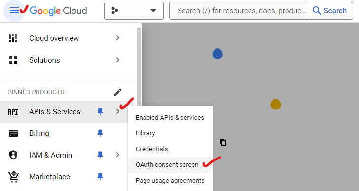
1. Select **Internal** for **User Type**
   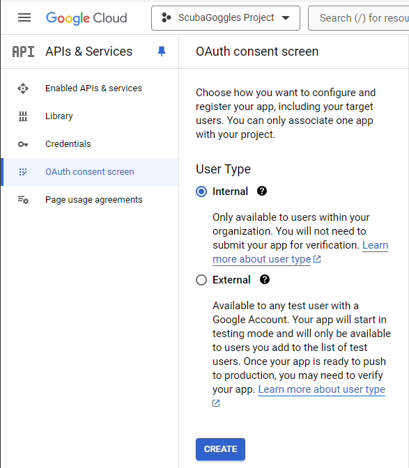
1. Click **Create**
1. Fill in your **App name** and **User support email**
   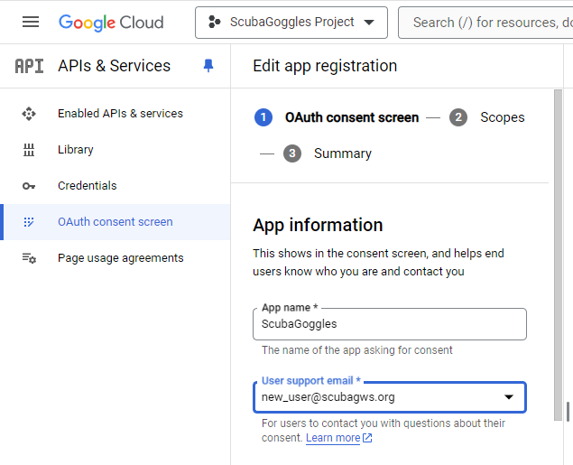
1. Scroll down to the **Authorized Domains** section
1. Under **Authorized domains**, add the primary domain of your GWS organization.
   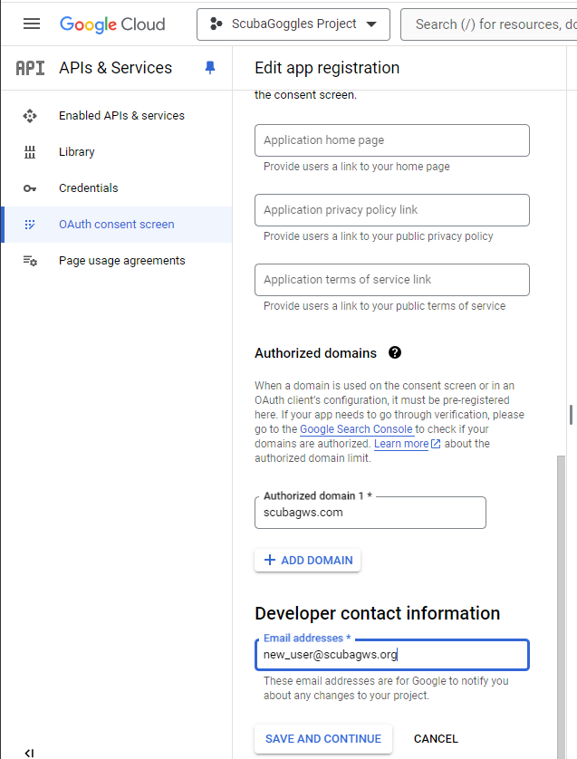
1. Add another email address for **Developer contact information**
1. Click **SAVE AND CONTINUE**
1. Do nothing on the **Scopes** screen, just click **SAVE AND CONTINUE**
1. Review summary, then click **BACK TO DASHBOARD**
1. Click **Credentials** from the menu on the left
   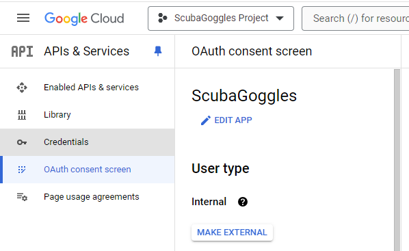
1. Click **CREATE CREDENTIALS**
   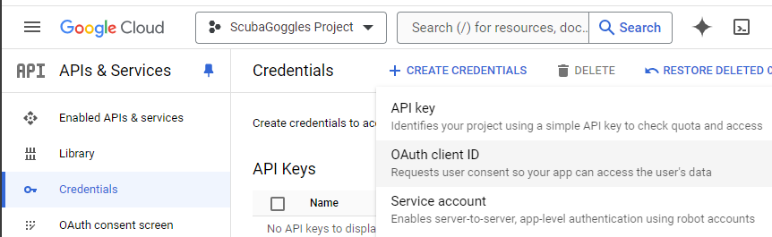
1. Select **Oauth client ID**
1. Select **Web application** for **Application type**
1. Give name as appropriate
1. Under **Authorized redirect URIs**, click "ADD URI." Add `http://localhost`
   and `http://localhost:8080/`. **NOTE** the ending slash (`/`) in the *second*
   URL is **necessary**.  If the slash is missing, you will eventually get an
   error when running ScubaGoggles (It will be an "access blocked" error on the
   Google authentication webpage.  You'll also see `Error 400:
   redirect_uri_mismatch`).
   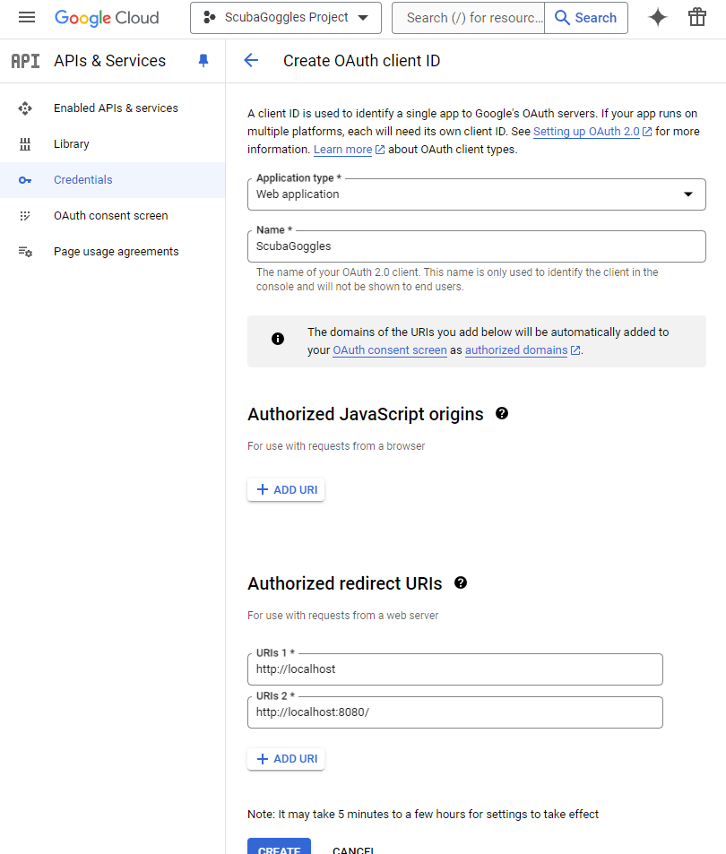
1. Click **CREATE**
1. Click **DOWNLOAD JSON** from the resulting **OAuth client created** page
   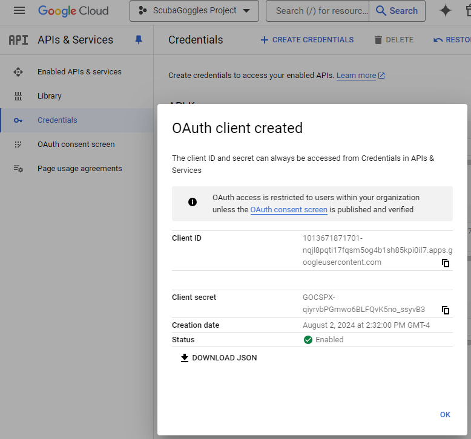
1. Click **OK**
1. Move the downloaded file (begins with `client_secret*.json`) to the
   location and name you specified when you ran the
   [ScubaGoggles setup utility](../installation/DownloadAndInstall.md#Running-ScubaGoggles-Setup-Utility).
   If you have not yet run the setup utility, you will specify this file as the
   credentials file when prompted by the setup utility.  You'll make it easier
   on yourself if you rename the file to something simple, like
   `credentials.json`.
   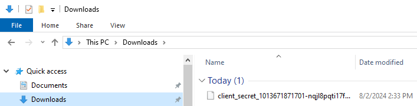
1. Go back the menu on the left and click **Enabled API Services**
1. In the center screen click **Enabled APIs & Services**
   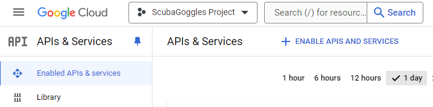
1. Search for and enable the **Admin SDK API**
   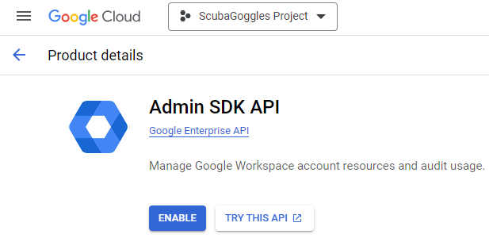
1. Search for and enable the **Groups Settings API**
   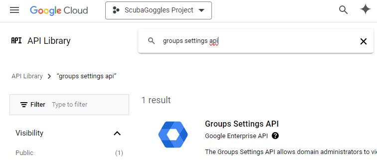
1. During the first run of this tool your default web browser will open up a page to consent to the API scopes needed to run this tool. Sign in
with an account with the necessary privileges and click allow.

## Add the Oauth App to the allowlist
If you've limited application access to Google's APIs in your organization, the [Common Controls: App Access to Google APIs](../../baselines/commoncontrols.md#10-app-access-to-google-apis) baseline covers this topic, follow the directions below to allowlist the OAuth app.

1. Login to https://console.cloud.google.com
2. Navigate to the appropriate project
3. Select **API's & Services** from the top left hamburger icon
4. Select **Credentials**
5. Copy your client ID under **OAuth 2.0 Client IDs**
6. Now login to [admin.google.com](https://admin.google.com/) and navigate to **Security** -> **Access and Data Control** -> **API Controls** -> **Manage Third-Party App Access**
7. Select **Add App** -> **Oauth App Name** or **Client ID**
8. Search by your **OAuth client ID**
9. Select the App
10. Select your root organization as the domain
11. Select **Trusted**

## Navigation
- Continue to [Usage: Parameters](../usage/Parameters.md)
- Return to [Documentation Home](/README.md)
