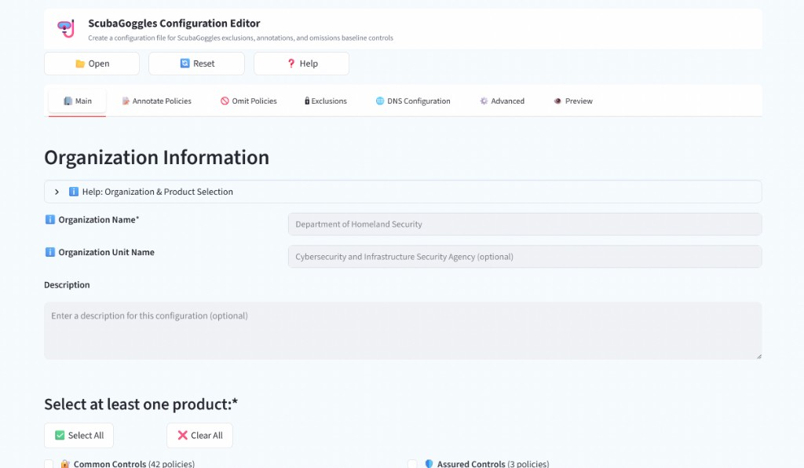
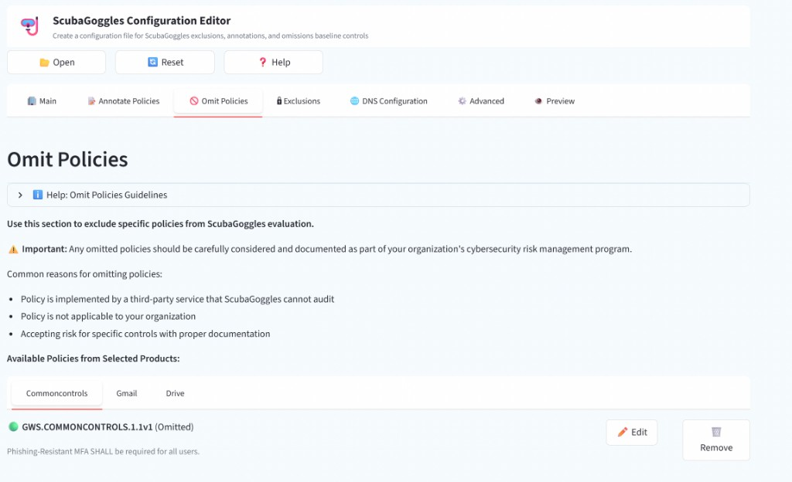
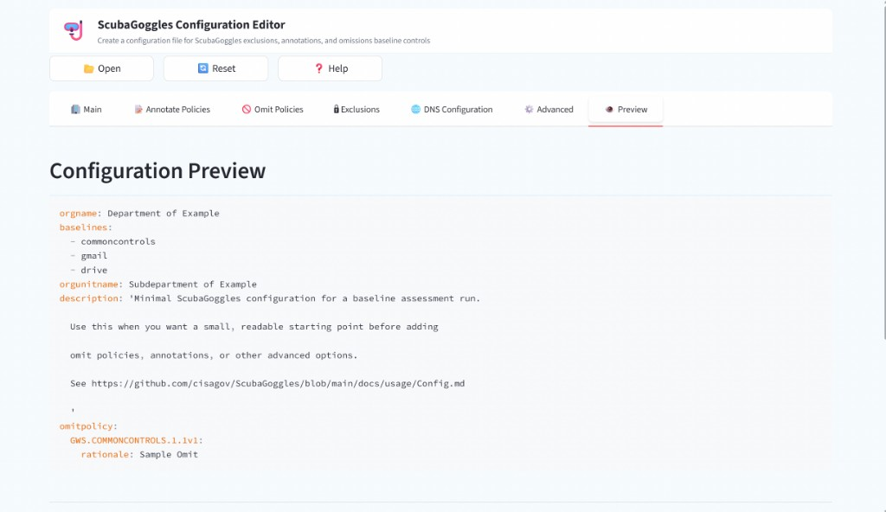

# ScubaGoggles Configuration UI

This directory contains a professional Streamlit-based configuration interface for ScubaGoggles, inspired by ScubaGear's ScubaConfigApp but built with Python and web technologies.

## Who is this for?

The Configuration UI is designed for users who want to build or edit ScubaGoggles YAML config files without hand-editing every field:

| Audience | How the UI helps |
|----------|------------------|
| **New ScubaGoggles users** | Guided forms, baseline selection, and validation before export |
| **Google Workspace administrators** | Browse policies by product and configure assessment scope visually |
| **Security and compliance teams** | Document omit policies and annotations with rationale, expiration, and remediation dates |
| **Assessors updating existing configs** | Import YAML with **Open**, modify settings, and re-export from **Preview** |

If you already have a working config file and only need to change one or two CLI flags, editing YAML or using command-line parameters may be faster. For omit policies, annotations, and organizational documentation, the UI is usually the easiest path. See [Which config path should I use?](../../docs/usage/Config.md#which-config-path-should-i-use) in the config file documentation.

## Overview

The ScubaGoggles Configuration UI provides a comprehensive web interface for creating ScubaGoggles configuration files to manage policy exclusions, annotations, and baseline control settings. The interface features:

- **Organization Information Management**: Configure organization details and descriptions
- **Product/Baseline Selection**: Visual selection of Google Workspace products to assess (11 products available)
- **Policy Omission**: Exclude specific policies with documented rationale and expiration dates
- **Policy Annotation**: Add comments, mark incorrect results, and set remediation dates
- **Exclusions**: Define break glass (emergency access) accounts and IMAP exceptions
- **Configuration Preview & Export**: View and download YAML configuration files
- **Dark Mode Support**: Automatically follows browser/OS dark mode preference, or use `--dark` / `SCUBAGOGGLES_UI_DARK` to force dark mode

## Features

The application consolidates all configuration capabilities into a single, professional interface with the following features:

- **Organization Configuration**: Configure organization name (required), unit name, and assessment description
- **Product Selection**: Choose from 11 Google Workspace baselines (Common Controls, Assured Controls, Gmail, Drive, Calendar, Meet, Groups, Chat, Sites, Classroom, Gemini) with icons, policy counts, and Select All/Clear All functionality
- **Policy Omission Management**: Exclude specific policies from assessment with documented rationale, optional expiration dates, and summary views
- **Policy Annotation**: Add comments and documentation to policies, mark incorrect results, set remediation dates with visual status indicators
- **Break Glass Account Configuration**: Define and manage super admin emergency access accounts with email validation
- **IMAP Exception Configuration**: Define OUs and groups where IMAP access is allowed per GWS.GMAIL.9.1
- **Authentication Settings**: Configure Service Account credentials (Customer ID, Subject Email, JSON file path), OAuth 2.0, or Application Default Credentials
- **Output & Execution Options**: Set output directory, report formats, quiet mode, and dark mode preferences
- **Configuration Management**: Import existing YAML files, preview generated configuration with validation, and download formatted YAML files
- **Visual Feedback**: Real-time status indicators (green dots for configured items, orange for editing), selection summaries, and comprehensive validation

## Files

- `scubaconfigapp.py` - Complete professional configuration application with all features
- `launch.py` - Launcher script that starts the Streamlit server and opens the browser
- `validation.py` - Configuration validation utilities
- `__init__.py` - Package initialization

## Installation

### Prerequisites

1. **ScubaGoggles** must be installed and available
2. **Python 3.10+** is required
3. **Streamlit** UI dependency

### Install Dependencies

```bash
# Install all requirements including UI dependencies (from the ScubaGoggles directory)
pip install -r requirements.txt
```

## Usage

### Method 1: Direct Launch (Recommended)

```bash
# From the ScubaGoggles root directory
python -m scubagoggles.ui.launch
```

This will start the Streamlit server and open the app in your default web browser. Dark mode is automatically detected from your browser's preferred color scheme via CSS media queries.

### Forcing dark mode

To force dark mode regardless of browser settings, use the `--dark` flag:

```bash
python -m scubagoggles.ui.launch --dark
```

Alternatively, set the `SCUBAGOGGLES_UI_DARK` environment variable. Truthy values: `1`, `true`, `yes`, `on` (case-insensitive):

```bash
# Linux / macOS
export SCUBAGOGGLES_UI_DARK=1
python -m scubagoggles.ui.launch

# Windows (PowerShell)
$env:SCUBAGOGGLES_UI_DARK = "1"
python -m scubagoggles.ui.launch
```

If you use **Method 2** (Streamlit only) and want to force dark mode, set the environment variable and pass the Streamlit theme flag:

```bash
export SCUBAGOGGLES_UI_DARK=1
streamlit run scubagoggles/ui/scubaconfigapp.py --theme.base dark
```

### Method 2: Streamlit Command

```bash
# From the ScubaGoggles root directory
streamlit run scubagoggles/ui/scubaconfigapp.py
```

## Interface Overview

### Navigation Tabs

1. **Main** - Configure organization information and select products to assess
2. **Annotate Policies** - Add comments, mark incorrect results, and set remediation dates
3. **Omit Policies** - Exclude specific policies with documented rationale
4. **Exclusions** - Configure break glass accounts and IMAP exceptions
5. **DNS Configuration** - Configure DNS resolvers and DoH fallback settings
6. **Advanced** - Configure strict mode, report options, and fail-fast behavior
7. **Preview** - Review and download the generated YAML configuration

### Header Toolbar

- **Open**: Import existing YAML configuration files via the browser file picker
- **Reset**: Reset all fields to defaults (with confirmation dialog)
- **Help**: Access comprehensive help and documentation

### Key Interface Elements

- **Status Indicators**: Green dots indicate configured items, orange dots show items being edited
- **Context Help**: Expandable help sections in each tab with guidelines and best practices
- **Validation**: Real-time validation ensures required fields are completed before export

## Screenshots

The images below walk through the most common Configuration UI workflows.

### Main tab — organization and baseline selection



Enter your organization name (required), optional unit name, and select which Google Workspace baselines to assess.

### Omit Policies tab



Browse policies by product, omit controls that do not apply, and provide a rationale for each omission. Green dots indicate configured omissions; orange dots indicate a policy currently being edited.

### Preview and export



Review the generated YAML on the **Preview** tab and download `scubagoggles_config.yaml` for use with `scubagoggles gws --config`.

## Omitting policies

Omit policies exclude specific controls from the assessment. Omitted policies appear as **Omitted** (gray) in the HTML report. All omissions should be approved through your organization's risk management process.

For YAML field definitions and examples, see [Omit Policies](../../docs/usage/Config.md#omit-policies) in the config file documentation. A ready-to-use sample is available at [`omit_policy_example.yaml`](../sample-config-files/omit_policy_example.yaml).

### Step-by-step: omit a policy in the UI

1. **Launch the UI**
   ```bash
   python -m scubagoggles.ui.launch
   ```

2. **Select baselines on the Main tab** — the Omit Policies tab only lists policies from baselines you have selected.

3. **Open the Omit Policies tab** — policies are grouped by product. Use the search box to find a policy by ID (for example, `GWS.GMAIL.1.1v1`).

4. **Click Omit on a policy** — the form expands with:
   - **Rationale** (required for good practice; ScubaGoggles warns if it is missing at runtime)
   - **Expiration** (optional; `yyyy-mm-dd` — after this date the policy is no longer omitted)

5. **Save the omission** — a green status dot appears next to configured policies.

6. **Preview and export** — open the **Preview** tab, confirm the `omitpolicy` block in the YAML, and download the file.

7. **Run ScubaGoggles**
   ```bash
   scubagoggles gws --config scubagoggles_config.yaml
   ```

### Importing an existing omit policy config

To start from a sample or existing file:

1. Click **Open** in the header toolbar
2. Select a YAML file (for example, [`omit_policy_example.yaml`](../sample-config-files/omit_policy_example.yaml))
3. Review entries on the **Omit Policies** tab
4. Export an updated file from **Preview**

Example YAML produced by the UI (equivalent to the sample file):

```yaml
omitpolicy:
  GWS.GMAIL.1.1v1:
    rationale: "Accepting risk for now; will reevaluate at a later date."
    expiration: "2030-12-31"
```

## Configuration Workflow

1. **Start the UI**: Launch using one of the methods above
2. **Organization Information**: Enter organization name (required) and unit name in the Main tab
3. **Select Products**: Choose which Google Workspace products to assess (at least one required)
4. **Annotate Policies** (Optional): Add comments and documentation to policy results
5. **Omit Policies** (Optional): Exclude specific policies with documented rationale
6. **Exclusions** (Optional): Configure break glass accounts and IMAP exceptions
7. **DNS Configuration** (Optional): Configure preferred DNS resolvers and DoH fallback behavior
8. **Advanced** (Optional): Configure strict mode, report output, and fail-fast behavior
9. **Preview & Export**: Review the generated configuration and download the YAML file

### Typical Use Cases

- **Creating a New Configuration**: Start with Main tab, select products, then Preview & Export
- **Managing Policy Exceptions**: Select products, go to Omit Policies tab, configure exclusions with rationale
- **Documentation & Remediation**: Select products, go to Annotate Policies tab, add comments and set remediation dates
- **Importing Existing Configuration**: Use Open button in header to import, review/modify settings, then export updated configuration

## Development

### Adding New Features

1. **UI Components**: Add to respective tab rendering methods
2. **Validation**: Extend `validation.py` with new validators


## Troubleshooting

### Common Issues

1. **ScubaGoggles Not Found**
   - Ensure ScubaGoggles is installed: `pip install scubagoggles`
   - Check Python path includes ScubaGoggles installation directory
   - Run from the ScubaGoggles root directory

2. **Streamlit Not Available**
   - Install requirements: `pip install -r requirements.txt`
   - Or install directly: `pip install streamlit`
   - Verify installation: `streamlit --version`

3. **Port Already in Use**
   - Streamlit default port (8501) may be in use
   - Specify different port: `streamlit run scubagoggles/ui/scubaconfigapp.py --server.port 8502`

4. **Module Import Errors**
   - Ensure you're running from the ScubaGoggles root directory
   - Check that `scubagoggles` package is in your Python path
   - Verify ScubaGoggles baseline files exist in `scubagoggles/baselines/`

5. **File Upload/Configuration Import Issues**
   - Check file permissions for uploaded files
   - Ensure YAML files are properly formatted
   - Verify configuration file schema matches ScubaGoggles requirements

### Getting Help

- [ScubaGoggles Documentation](https://github.com/cisagov/ScubaGoggles)
- [Streamlit Documentation](https://docs.streamlit.io/)
- [Report Issues](https://github.com/cisagov/ScubaGoggles/issues)

## License

This code is part of ScubaGoggles and follows the same license terms.

## Contributing

Contributions are welcome! Please see the main ScubaGoggles repository for contribution guidelines.
